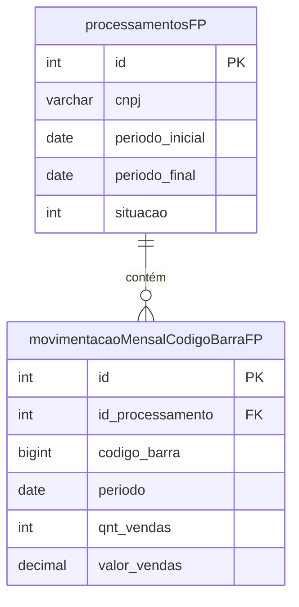

# Estrutura de Tabelas de Resultado

Esta seção detalha as tabelas criadas pelo sistema para armazenar os resultados da auditoria.

---

## 1. Tabela de Processamentos

### 1.1. Identificação

| Atributo           | Valor                                                |
| ------------------ | ---------------------------------------------------- |
| **Nome da Tabela** | `temp_CGUSC.dbo.processamentosFP`                    |
| **Função**         | Registrar o status de processamento de cada farmácia |
| **Criada por**     | Script de Preparação (Fase 1)                        |
| **Populada por**   | Script Python (Fase 2)                               |

### 1.2. Descrição

Contém **dados de processamento** de cada estabelecimento, como a data de processamento e o período analisado. Funciona como um **log de execução** e permite monitorar o progresso da análise.

### 1.3. Estrutura Completa

| Campo                          | Tipo          | Descrição                     | Exemplo                             |
| ------------------------------ | ------------- | ----------------------------- | ----------------------------------- |
| `id`                           | INT IDENTITY  | Código incremental único      | 12345                               |
| `cnpj`                         | VARCHAR(14)   | CNPJ do estabelecimento       | 12345678000199                      |
| `razao_social`                 | VARCHAR(200)  | Razão social da farmácia      | FARMACIA EXEMPLO LTDA               |
| `nome_fantasia`                | VARCHAR(200)  | Nome fantasia                 | FARMACIA EXEMPLO                    |
| `municipio`                    | VARCHAR(100)  | Município de localização      | FLORIANÓPOLIS                       |
| `uf`                           | CHAR(2)       | Unidade da Federação          | SC                                  |
| `periodo_inicial`              | DATE          | Data de início da análise     | 2015-07-01                          |
| `periodo_final`                | DATE          | Data final da análise         | 2024-12-10                          |
| `data_processamento`           | DATETIME      | Momento do processamento      | 2025-01-15 10:30:00                 |
| `situacao`                     | INT           | Código de status              | 1                                   |
| `status_detalhado`             | VARCHAR(500)  | Mensagem de status            | Processamento concluído com sucesso |
| `tempo_processamento_segundos` | DECIMAL(10,2) | Tempo de execução em segundos | 45.32                               |
| `total_registros_processados`  | INT           | Quantidade de transações      | 15420                               |
| `total_medicamentos`           | INT           | Quantidade de GTINs distintos | 87                                  |

### 1.4. Códigos de Situação

| Código | Constante       | Significado                 | Descrição                                           |
| ------ | --------------- | --------------------------- | --------------------------------------------------- |
| **1**  | `SIT_SUCCESS`   | Sucesso com irregularidades | Processamento concluído, irregularidades detectadas |
| **2**  | `SIT_RUNNING`   | Em andamento                | Processamento iniciado, ainda não finalizado        |
| **3**  | `SIT_FAILED`    | Falha                       | Erro durante a execução                             |
| **4**  | `SIT_NO_DATA`   | Sem dados                   | CNPJ não possui dados no período                    |
| **5**  | `SIT_NO_SALES`  | Sem vendas                  | CNPJ sem registros de venda                         |
| **6**  | `SIT_NO_ISSUES` | Sucesso sem irregularidades | Processamento concluído, nenhuma irregularidade     |

### 1.5. Uso no Sistema

- **Controle de Execução:** Permite identificar CNPJs já processados
- **Retomada de Falhas:** Identifica processamentos interrompidos
- **Monitoramento:** Acompanhamento do progresso em tempo real
- **Auditoria:** Log completo de quando e como cada CNPJ foi processado

---

## 2. Tabela de Movimentação Mensal

### 2.1. Identificação

| Atributo           | Valor                                               |
| ------------------ | --------------------------------------------------- |
| **Nome da Tabela** | `temp_CGUSC.dbo.movimentacaoMensalCodigoBarraFP`    |
| **Função**         | Armazenar resumo mensal da movimentação por produto |
| **Criada por**     | Script de preparação (Fase 1)                       |
| **Populada por**   | Script Python (Fase 2)                              |

### 2.2. Descrição

Contém dados de movimentação dos estabelecimentos em **granularidade mensal por produto**. Esta tabela permite análise temporal (evolução ao longo dos meses) e por medicamento.

### 2.3. Estrutura Completa

| Campo                        | Tipo          | Descrição                           | Exemplo       |
| ---------------------------- | ------------- | ----------------------------------- | ------------- |
| `id`                         | INT IDENTITY  | Código incremental único            | 98765         |
| `id_processamento`           | INT           | FK para processamentosFP            | 12345         |
| `codigo_barra`               | BIGINT        | GTIN do medicamento                 | 7891234567890 |
| `periodo`                    | DATE          | Mês/ano da consolidação (dia 01)    | 2023-06-01    |
| `qnt_vendas`                 | INT           | Quantidade total vendida no período | 150           |
| `qnt_vendas_sem_comprovacao` | INT           | Quantidade sem comprovação          | 45            |
| `valor_vendas`               | DECIMAL(12,2) | Valor total das vendas              | 3500.00       |
| `valor_sem_comprovacao`      | DECIMAL(12,2) | Valor sem comprovação               | 1050.00       |

### 2.4. Relacionamento

### 2.5. Uso no Sistema

- **Fase 3 (Relatórios):** Base para gráficos de evolução financeira
- **Fase 4 (Análise):** Agregação para indicadores gerenciais
- **Análise Temporal:** Identificar quando irregularidades começaram

---

## 3. Tabela de Memória de Cálculo

### 3.1. Identificação

| Atributo           | Valor                                          |
| ------------------ | ---------------------------------------------- |
| **Nome da Tabela** | `temp_CGUSC.dbo.memoria_calculo_consolidadaFP` |
| **Função**         | Armazenar memória de cálculo comprimida        |
| **Populada por**   | Script Python (Fase 2)                         |

### 3.2. Descrição

Armazena a **memória de cálculo completa** de cada processamento em formato JSON comprimido (Zlib). Esta tabela permite a **regeneração de relatórios** sem necessidade de reprocessamento.

### 3.3. Estrutura

| Campo               | Tipo           | Descrição                |
| ------------------- | -------------- | ------------------------ |
| `id`                | INT IDENTITY   | Código incremental único |
| `id_processamento`  | INT            | FK para processamentosFP |
| `cnpj`              | VARCHAR(14)    | CNPJ da farmácia         |
| `dados_comprimidos` | VARBINARY(MAX) | JSON comprimido com Zlib |

### 3.4. Estrutura do JSON Interno

Quando descomprimido, o JSON contém uma lista de registros com a seguinte estrutura:

| Campo                    | Descrição                                                                                                |
| ------------------------ | -------------------------------------------------------------------------------------------------------- |
| `tipo`                   | Tipo do registro: 'h' (header), 'e' (estoque), 'c' (compra), 'd' (devolução), 'v' (venda), 's' (sumário) |
| `codigo_barra`           | GTIN do medicamento                                                                                      |
| `periodo_inicial`        | Data de início do período de vendas                                                                      |
| `periodo_final`          | Data final do período de vendas                                                                          |
| `estoque_inicial`        | Estoque no início do período                                                                             |
| `estoque_final`          | Estoque no final do período                                                                              |
| `vendas_periodo`         | Quantidade vendida no período                                                                            |
| `vendas_sem_comprovacao` | Quantidade sem comprovação                                                                               |
| `valor_movimentado`      | Valor total das vendas                                                                                   |
| `valor_sem_comprovacao`  | Valor sem comprovação                                                                                    |
| `data_aquis_dev_estoq`   | Data de aquisição/devolução/estoque                                                                      |
| `qnt_aquis_dev`          | Quantidade adquirida/devolvida                                                                           |
| `numero_nfe`             | Número da nota fiscal                                                                                    |

### 3.5. Tipos de Registro

| Tipo | Nome      | Descrição                                    |
| ---- | --------- | -------------------------------------------- |
| `h`  | Header    | Cabeçalho do produto (GTIN)                  |
| `e`  | Estoque   | Estoque inicial estimado                     |
| `c`  | Compra    | Transação de aquisição (entrada)             |
| `d`  | Devolução | Transação de devolução/transferência (saída) |
| `v`  | Venda     | Bloco consolidado de vendas                  |
| `s`  | Sumário   | Totais do produto                            |

### 3.6. Compressão

!!! info "Otimização de Espaço"
A memória de cálculo é comprimida usando **Zlib nível 9** (máxima compressão), resultando em redução de aproximadamente **90%** no tamanho dos dados.

---

## 4. Tabela de Estoque Inicial

### 4.1. Identificação

| Atributo           | Valor                                                        |
| ------------------ | ------------------------------------------------------------ |
| **Nome da Tabela** | `temp_CGUSC.dbo.estoque_inicialFP`                           |
| **Função**         | Armazenar estimativa de estoque inicial por produto/farmácia |
| **Criada por**     | Script de preparação (Fase 1)                                |

### 4.2. Estrutura

| Campo                  | Tipo        | Descrição                              |
| ---------------------- | ----------- | -------------------------------------- |
| `cnpj_estabelecimento` | VARCHAR(14) | CNPJ da farmácia                       |
| `codigo_barra`         | BIGINT      | GTIN do medicamento                    |
| `estoque_inicial`      | INT         | Quantidade estimada de estoque inicial |
| `data_estoque_inicial` | DATE        | Data de referência do estoque          |

### 4.3. Metodologia de Cálculo

O estoque inicial é estimado através da seguinte metodologia:

1. Identifica a data da primeira venda do produto na farmácia
2. Busca notas fiscais de aquisição nos 6 meses anteriores
3. Ordena as notas da mais recente para a mais antiga
4. Soma as quantidades das **duas últimas aquisições**

!!! info "Critério do Estoque Inicial"
**"Soma das duas últimas aquisições, considerando os 6 meses anteriores à primeira venda."**

    Este critério foi definido para criar uma estimativa conservadora e auditável.

---

## 5. Tabela de Notas do Estoque Inicial

### 5.1. Identificação

| Atributo           | Valor                                                |
| ------------------ | ---------------------------------------------------- |
| **Nome da Tabela** | `temp_CGUSC.dbo.notas_estoque_inicialFP`             |
| **Função**         | Rastrear as NFs usadas no cálculo do estoque inicial |

### 5.2. Descrição

Armazena as **notas fiscais exatas** que foram utilizadas para compor a estimativa de estoque inicial. Garante a **rastreabilidade** e **auditabilidade** da metodologia.

### 5.3. Estrutura

| Campo                  | Tipo        | Descrição             |
| ---------------------- | ----------- | --------------------- |
| `cnpj_estabelecimento` | VARCHAR(14) | CNPJ da farmácia      |
| `quantidade`           | INT         | Quantidade da NF      |
| `codigo_barra`         | BIGINT      | GTIN do medicamento   |
| `data_aquisicao`       | DATE        | Data da nota fiscal   |
| `numero_nfe`           | BIGINT      | Número da nota fiscal |

---

## 6. Tabela de Resultado Consolidado

### 6.1. Identificação

| Atributo           | Valor                                                     |
| ------------------ | --------------------------------------------------------- |
| **Nome da Tabela** | `temp_CGUSC.dbo.resultado_Sentinela_2015_2024`            |
| **Função**         | Consolidar todos os resultados e indicadores por farmácia |
| **Criada por**     | Script de pós-processamento (Fase 4)                      |

### 6.2. Descrição

Esta é a **tabela final** do projeto. Consolida todos os resultados da auditoria e os indicadores de risco em uma única visão por farmácia.

### 6.3. Campos Principais

| Categoria                   | Campos                                                                      |
| --------------------------- | --------------------------------------------------------------------------- |
| **Identificação**           | cnpj, razaoSocial, municipio, uf                                            |
| **Resultados da Auditoria** | valor_vendas, valor_sem_comprovacao, qnt_vendas, qnt_vendas_sem_comprovacao |
| **Percentuais**             | pct_irregularidade                                                          |
| **Contexto**                | num_estabelecimentos_municipio, num_meses_movimentacao, populacao_municipio |
| **Indicadores**             | Todos os 17 indicadores de risco                                            |

---

## 7. Tabela de Matriz de Risco

### 7.1. Identificação

| Atributo           | Valor                                          |
| ------------------ | ---------------------------------------------- |
| **Nome da Tabela** | `temp_CGUSC.dbo.Matriz_Risco_Final`            |
| **Função**         | Consolidar scores e rankings de risco          |
| **Criada por**     | Script de indicadores (matriz_risco_final.sql) |

### 7.2. Campos Principais

| Campo                  | Descrição                                                |
| ---------------------- | -------------------------------------------------------- |
| `cnpj`                 | CNPJ da farmácia                                         |
| `SCORE_RISCO_FINAL`    | Score consolidado (0 a 10+)                              |
| `CLASSIFICACAO_RISCO`  | Categoria de risco (CRÍTICO, ALTO, MÉDIO, BAIXO, MÍNIMO) |
| `rank_nacional`        | Posição no ranking nacional                              |
| `rank_uf`              | Posição no ranking estadual                              |
| `rank_municipio`       | Posição no ranking municipal                             |
| `total_nacional`       | Total de farmácias no país                               |
| `total_uf`             | Total de farmácias no estado                             |
| `total_municipio`      | Total de farmácias no município                          |
| `flag_qualidade_dados` | Indicador de confiabilidade (ALTA, MEDIA, BAIXA)         |

---

!!! tip "Próximo Passo"
Veja o [Fluxo de Dados](fluxo-dados.md) para entender como os dados fluem entre as tabelas.
