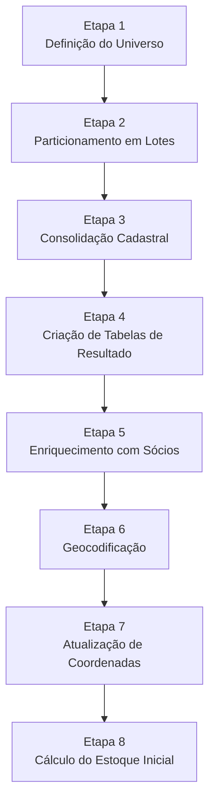

# Fase 1: Preparação dos Dados

A Fase 1 é responsável por **estruturar e limpar os dados brutos** para processamento eficiente. Todo o trabalho desta fase é realizado em SQL.

---

## 1. Visão Geral

### 1.1. Objetivo

Preparar o ambiente de dados para que o script Python (Fase 2) possa processar cada estabelecimento de forma eficiente e isolada.

### 1.2. Script Principal

```
📄 01 - preparacao_dados.sql
```

### 1.3. Etapas da Fase 1



---

## 2. Etapa 1: Definição do Universo de Análise

### 2.1. O que faz

Cria a tabela `temp_CGUSC.dbo.lista_cnpjs` contendo todos os CNPJs que serão analisados.

### 2.2. Como funciona

1. Consulta a tabela principal de vendas do Farmácia Popular
2. Extrai os CNPJs únicos (`SELECT DISTINCT cnpj`)
3. Filtra apenas as movimentações dentro do período de análise
4. Salva na tabela `lista_cnpjs`

### 2.3. Parâmetros de Filtro

| Parâmetro    | Valor Padrão | Descrição                    |
| ------------ | ------------ | ---------------------------- |
| Data Inicial | 2015-07-01   | Início do período de análise |
| Data Final   | 2024-12-10   | Fim do período de análise    |

### 2.4. Importância

!!! success "Por que isso importa"
Este passo define o **escopo total da auditoria**. Apenas as farmácias presentes nesta lista serão processadas nas fases seguintes. É o ponto de partida que delimita o universo de trabalho.

---

## 3. Etapa 2: Particionamento para Processamento em Lotes

### 3.1. O que faz

Cria a tabela `temp_CGUSC.dbo.classif` que divide o universo de CNPJs em **100 lotes** de tamanho aproximadamente igual.

### 3.2. Como funciona

Utiliza a função de janela `NTILE(100)` do SQL Server:

1. Ordena todos os CNPJs alfabeticamente
2. Distribui sequencialmente em 100 grupos
3. Cada CNPJ recebe um número de lote (1 a 100)

### 3.3. Estrutura da Tabela

| Campo     | Tipo        | Descrição                |
| --------- | ----------- | ------------------------ |
| `cnpj`    | VARCHAR(14) | CNPJ da farmácia         |
| `classif` | INT         | Número do lote (1 a 100) |

### 3.4. Importância

!!! warning "Otimização Crítica"
Esta é uma **otimização de performance crítica**. Processar centenas de milhares de CNPJs de uma só vez consumiria uma quantidade massiva de memória e poderia levar a falhas ou timeouts.

    Ao dividir o trabalho em 100 lotes, o script Python pode processar um lote de cada vez, tornando o processo:

    - ✅ Mais estável
    - ✅ Mais gerenciável
    - ✅ Passível de interrupção e retomada

---

## 4. Etapa 3: Consolidação de Dados Cadastrais e de Contato

### 4.1. Mapeamento da Primeira Venda

#### 4.1.1. O que faz

Cria a tabela `temp_CGUSC.dbo.farmaciasInicioVendas` com a data da primeira venda de cada farmácia.

#### 4.1.2. Como funciona

Utiliza `MIN(data_hora)` agrupado por CNPJ para encontrar a transação mais antiga de cada estabelecimento.

#### 4.1.3. Importância

Esta data serve como **marco temporal importante**, indicando o início das atividades da farmácia dentro do programa.

---

### 4.2. Consolidação dos Contatos

#### 4.2.1. O que faz

Gera a tabela `temp_CGUSC.dbo.contatoFarmacia` com dados de contato limpos e deduplicados.

#### 4.2.2. Como funciona

O script realiza uma operação sofisticada de consolidação:

1. **União de Fontes:** Combina dados de contato de múltiplas tabelas usando `UNION ALL`
2. **Priorização:** Usa `ROW_NUMBER()` para numerar registros, priorizando fontes mais recentes
3. **Deduplicação:** Seleciona apenas o registro de maior prioridade para cada CNPJ
4. **Tratamento de Nulos:** Usa `COALESCE` para substituir valores nulos

#### 4.2.3. Importância

Garante que os relatórios e possíveis comunicações utilizem as informações de contato **mais atualizadas e relevantes**.

---

## 5. Etapa 4: Criação da Estrutura de Tabelas de Resultados

### 5.1. O que faz

Cria as tabelas que receberão os resultados do processamento:

- `processamentosFP`
- `dadosProcessamentosFP`
- `movimentacaoMensalCodigoBarraFP`

### 5.2. Como funciona

Utiliza comandos `CREATE TABLE` para definir:

- Estrutura de colunas e tipos de dados
- Chaves primárias e relacionamentos (FOREIGN KEY)
- Índices para otimização

### 5.3. Importância

!!! info "Tabelas Vazias"
Neste momento, as tabelas são criadas **vazias**. Elas servem como o "esqueleto" que será preenchido com os resultados detalhados gerados pelo script Python na Fase 2.

    Definir a estrutura antecipadamente garante a **integridade dos dados** que serão inseridos posteriormente.

---

## 6. Etapa 5: Enriquecimento com Dados de Sócios e Perfis

### 6.1. Perfil dos Sócios (tb_sociosFP)

#### 6.1.1. O que faz

Cria um perfil detalhado dos sócios de cada farmácia.

#### 6.1.2. Como funciona

1. Cruza a `lista_cnpjs` com as bases da Receita Federal
2. Busca dados de sócios na tabela `db_CNPJ.dbo.socios`
3. Filtra apenas sócios ativos e com participação societária
4. Inclui apenas empresas com situação cadastral ativa

#### 6.1.3. Filtros Aplicados

| Filtro        | Condição                        | Motivo                                 |
| ------------- | ------------------------------- | -------------------------------------- |
| Sócio Ativo   | `dataExclusaoSociedade IS NULL` | Excluir sócios que saíram da sociedade |
| Participação  | `percentualQualificacao > 0`    | Apenas sócios com participação efetiva |
| Empresa Ativa | `SituacaoCadastral = 2`         | Apenas empresas ativas na Receita      |

#### 6.1.4. Importância

!!! tip "Uso em Investigações"
Esta tabela é fundamental para identificar **sócios em comum** entre farmácias com comportamento suspeito, o que pode indicar a existência de **redes ou fraudes organizadas**.

---

### 6.2. Perfil da Farmácia (dadosFarmaciasFP)

#### 6.2.1. O que faz

Consolida todas as informações cadastrais em uma única tabela.

#### 6.2.2. Como funciona

O processo utiliza tabelas temporárias para construir gradualmente o perfil:

1. Une dados de endereço
2. Adiciona natureza jurídica e situação cadastral
3. Inclui dados do responsável pela empresa
4. Calcula o campo `outrasSociedades`

#### 6.2.3. Campo outrasSociedades

Este campo é calculado através de uma subconsulta complexa que verifica:

- Se algum dos sócios da farmácia em questão
- Possui participação em outras farmácias da `lista_cnpjs`

#### 6.2.4. Importância

Cria uma **fonte de verdade única e abrangente** para os dados cadastrais, que será usada extensivamente nos relatórios e na tabela de análise final.

---

## 7. Etapa 6: Preparação para Geocodificação

### 7.1. O que faz

Gera uma consulta que formata os endereços das farmácias para geocodificação externa.

### 7.2. Como funciona

1. Concatena os campos de endereço em uma única string
2. Formata: logradouro, número, bairro, município, UF
3. Resultado é exportado para Excel

### 7.3. Processo Externo

!!! warning "Etapa Manual"
O resultado desta consulta é usado como entrada para um **script externo** (`Coordenadas.py`) que obtém as coordenadas geográficas de cada endereço através de APIs de geocodificação.

---

## 8. Etapa 7: Atualização das Coordenadas Geográficas

### 8.1. O que faz

Atualiza a tabela `dadosFarmaciasFP` com os dados de latitude e longitude obtidos no processo de geocodificação.

### 8.2. Importância

Permite **análises espaciais**, como:

- Visualização de farmácias em mapas
- Cálculo de distância entre estabelecimentos
- Cruzamento com dados socioeconômicos georreferenciados
- Detecção de anomalias geográficas (pacientes distantes)

---

## 9. Etapa 8: Cálculo do Estoque Inicial

Esta é a etapa **mais complexa e metodologicamente mais importante** de todo o script de preparação. A precisão da auditoria depende diretamente da qualidade desta estimativa.

### 9.1. O que faz

Estima o **estoque inicial** para cada medicamento em cada farmácia.

### 9.2. Por que é necessário

!!! danger "Problema"
Sem uma estimativa de estoque inicial, as **primeiras vendas** de qualquer farmácia seriam incorretamente sinalizadas como "sem comprovação", gerando **muitos falsos positivos**.

### 9.3. Metodologia: Passo a Passo

O cálculo é feito através de uma sequência de tabelas:

#### Passo 1: farmacia_inicio_venda_gtin

Identifica a **data da primeira venda de cada produto** (GTIN) em cada farmácia.

```
Para cada combinação (CNPJ, GTIN):
    → Encontra MIN(data_venda)
```

#### Passo 2: Definição da Janela de Busca

Com base na data encontrada, define uma **janela de busca de 6 meses para trás**:

```
Janela = [data_primeira_venda - 6 meses, data_primeira_venda]
```

#### Passo 3: Busca de Notas Fiscais

Procura todas as **notas fiscais de aquisição** (tipoOperacao = 1) dentro da janela de 6 meses.

#### Passo 4: Ordenação das Notas

As notas encontradas são **classificadas da mais recente para a mais antiga** usando `ROW_NUMBER()`:

```
ROW_NUMBER() OVER (
    PARTITION BY cnpj, codigo_barra
    ORDER BY data_aquisicao DESC
)
```

#### Passo 5: Cálculo do Estoque Inicial

O estoque inicial é calculado como a **soma das duas notas fiscais mais recentes**:

$$
\text{Estoque Inicial} = \sum_{i=1}^{2} \text{Quantidade}_i \quad \text{onde } i \text{ são as 2 NFs mais recentes}
$$

```
WHERE row_num < 3  -- Apenas as 2 primeiras
```

#### Passo 6: Rastreabilidade

As notas fiscais exatas que foram usadas são salvas na tabela `notas_estoque_inicialFP` para **total transparência**.

### 9.4. Critério Oficial

!!! quote "Critério de Estoque Inicial"
**"Soma das duas últimas aquisições, considerando os 6 meses anteriores à primeira venda."**

### 9.5. Justificativa do Critério

| Aspecto                       | Justificativa                                                           |
| ----------------------------- | ----------------------------------------------------------------------- |
| **Por que 2 NFs?**            | Evita distorções de uma única compra atípica; média ponderada implícita |
| **Por que 6 meses?**          | Período razoável para farmácia ter estoque; evita dados muito antigos   |
| **Por que as mais recentes?** | Refletem melhor o estoque no momento da primeira venda                  |

### 9.6. Tabelas Geradas

| Tabela                       | Conteúdo                                    |
| ---------------------------- | ------------------------------------------- |
| `farmacia_inicio_venda_gtin` | Data da primeira venda por produto/farmácia |
| `estoque_inicialFP`          | Valor estimado do estoque inicial           |
| `notas_estoque_inicialFP`    | NFs usadas no cálculo (rastreabilidade)     |

### 9.7. Importância

!!! success "Resultado"
Este método cria uma **linha de base justa e defensável**, baseada no próprio histórico de compras da farmácia, para iniciar a análise de fluxo de estoque.

    A gravação das notas utilizadas garante a **rastreabilidade e auditabilidade** da própria metodologia.

---

## 10. Parâmetros que Devem Ser Ajustados

Antes de executar o script de preparação, ajuste os seguintes parâmetros:

| Linha | Parâmetro                                                     | Descrição                     |
| ----- | ------------------------------------------------------------- | ----------------------------- |
| 9     | `data_hora BETWEEN '2015-07-01' AND '2024-12-10'`             | Período para seleção de CNPJs |
| 41    | `data_hora BETWEEN '2015-07-01' AND '2024-12-10'`             | Período para primeira venda   |
| 288   | `a.data_hora >= '2015-07-01' and a.data_hora <= '2024-12-10'` | Período para estoque inicial  |

---

!!! tip "Próximo Passo"
Veja a [Fase 2: Processamento](fase2-processamento.md) para entender como o Python executa a simulação de fluxo de estoque.
