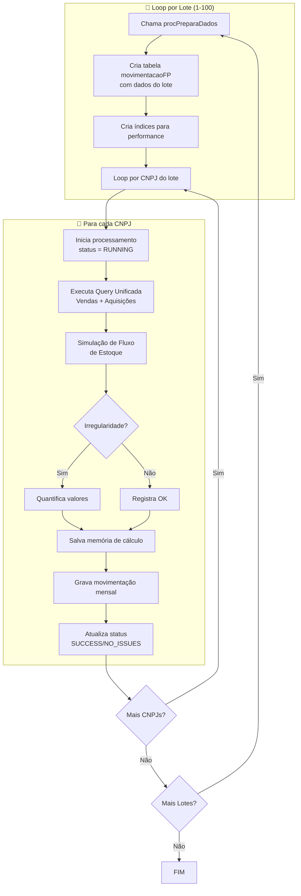
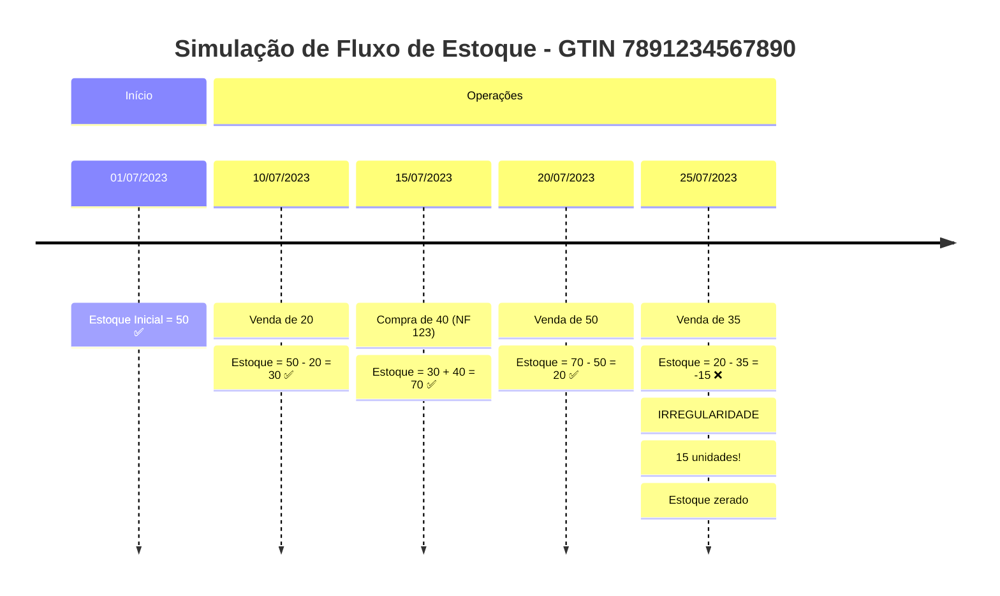

# Fase 2: Processamento dos Dados

Nesta fase, os dados brutos, já limpos e estruturados pela Fase 1, são **ativamente processados** para identificar inconsistências. O trabalho é dividido entre SQL (preparação do lote) e Python (lógica de auditoria).

---

## 1. Visão Geral

### 1.1. Objetivo

Executar a **simulação de fluxo de estoque** para cada farmácia e identificar vendas sem comprovação de lastro em aquisições.

### 1.2. Scripts Envolvidos

| Script                      | Tipo             | Função                            |
| --------------------------- | ---------------- | --------------------------------- |
| `03 - procPreparaDados.sql` | Stored Procedure | Prepara o ambiente para cada lote |
| `sentinelav8.py`            | Python           | Executa a lógica de auditoria     |

### 1.3. Diagrama de Fluxo



---

## 2. Parte 1: Stored Procedure procPreparaDados

### 2.1. Papel e Propósito

A Stored Procedure `procPreparaDados` atua como um **"preparador de ambiente"**. Sua única função é criar um ambiente de dados pequeno, focado e otimizado para um lote específico de CNPJs.

### 2.2. Benefícios

| Benefício       | Descrição                                                                 |
| --------------- | ------------------------------------------------------------------------- |
| **Foco**        | Isola os dados de um único lote para evitar consultas em tabelas massivas |
| **Performance** | Delega o trabalho pesado de filtragem ao banco de dados                   |
| **Recuperação** | Garante retomada limpa após falhas                                        |

### 2.3. Parâmetros

| Parâmetro   | Direção | Tipo | Descrição                                        |
| ----------- | ------- | ---- | ------------------------------------------------ |
| `@classif`  | Entrada | INT  | Número do lote a ser preparado (1-100)           |
| `@rowcount` | Saída   | INT  | Número de linhas inseridas na tabela de trabalho |

### 2.4. Lógica Interna

#### 2.4.1. Limpeza de Execução Incompleta

A procedure primeiro executa uma **limpeza precisa e direcionada**:

1. Identifica o `id` do processamento mais recente
2. Apaga registros "filhos" em cascata (`movimentacaoMensalCodigoBarraFP`)
3. Apaga o registro "pai" (`processamentosFP`)

!!! warning "Mecanismo de Recuperação"
Este mecanismo parte do princípio de que se o script parou de forma inesperada, a última entrada na tabela `processamentosFP` pode representar um CNPJ cujo processamento foi interrompido, deixando **dados parciais e inconsistentes**.

    A limpeza garante que, antes de iniciar um novo bloco, os dados da última tentativa sejam completamente removidos.

#### 2.4.2. Recriação da Tabela de Classificação

A tabela `classif` é recriada com um filtro importante:

```
WHERE cnpj NOT IN (SELECT cnpj FROM processamentosFP)
```

!!! success "Funcionalidade de Retomada"
Esta lógica recalcula os lotes usando apenas os CNPJs que **ainda não foram processados**. Se o script parar no lote 25, ao ser reiniciado, ele não refará os lotes 1 a 24 - irá direto para os CNPJs pendentes.

#### 2.4.3. Criação do Workspace (movimentacaoFP)

1. A tabela de trabalho `movimentacaoFP` é **recriada do zero**
2. É populada apenas com transações do lote atual
3. Índices são criados nas colunas mais usadas

!!! tip "Otimização Principal"
Em vez do Python fazer consultas em uma tabela com **bilhões de registros**, ele faz consultas em uma tabela menor que contém apenas os dados relevantes para o lote atual.

#### 2.4.4. Indexação Dinâmica

Após popular a tabela, índices são criados nas colunas:

- `codigo_barra`
- `cnpj`
- `data_hora`

Índices aceleram drasticamente as consultas subsequentes.

---

## 3. Parte 2: Script Python (sentinelav8.py)

### 3.1. Papel e Propósito

Com o ambiente preparado pela Stored Procedure, o script Python assume a **lógica de auditoria detalhada**, CNPJ por CNPJ.

| Responsabilidade      | Descrição                                            |
| --------------------- | ---------------------------------------------------- |
| **Orquestração**      | Controla o fluxo geral, iterando sobre lotes e CNPJs |
| **Lógica de Negócio** | Aplica a simulação de fluxo de estoque linha a linha |
| **Persistência**      | Salva os resultados detalhados no banco              |
| **Relatórios**        | Dispara a geração dos arquivos Excel                 |

### 3.2. Inicialização e Cache em Memória

Antes do loop principal, o script carrega tabelas de apoio em **dicionários Python**:

- `dados_farmacias` - Cadastro das farmácias
- `dados_medicamentos` - Dicionário de medicamentos
- `contato_farmacia` - Informações de contato
- `farmacia_inicio_venda` - Data de início de cada farmácia
- `tabela_codigo_barra_estoque_inicial` - Estoque inicial por produto

!!! success "Cache Local"
Ter esses dados em memória evita milhares de pequenas consultas repetitivas ao banco, **acelerando enormemente** o processo.

### 3.3. Loop Externo: Iteração por Bloco

O script itera sobre cada um dos 100 lotes:

```
for i in tqdm(classif_list, desc="Progresso Geral:"):
    # 1. Chama procPreparaDados para o lote i
    # 2. Obtém lista de CNPJs do lote
    # 3. Processa cada CNPJ
```

A biblioteca `tqdm` exibe uma **barra de progresso** no terminal.

### 3.4. Loop Interno: Iteração por CNPJ

Para cada CNPJ do lote:

```
for cnpj in tqdm(lista_cnpjs, desc=f"Bloco {i}:"):
    # 1. Verifica se já foi processado
    # 2. Inicia registro com status RUNNING
    # 3. Executa query unificada
    # 4. Simula fluxo de estoque
    # 5. Salva resultados
    # 6. Finaliza com status SUCCESS
```

### 3.5. Verificação de Processamento Prévio

Antes de processar, o sistema verifica se o CNPJ já foi processado com sucesso:

```python
if verificar_processamento_existente(cursor, cnpj):
    continue  # Pula para o próximo
```

Isso permite **retomada eficiente** em caso de interrupção.

---

## 4. A Query Unificada

### 4.1. O que é

Uma consulta SQL complexa que cria uma **"linha do tempo"** de todas as movimentações de estoque de um CNPJ.

### 4.2. Estrutura

A query combina dois conjuntos de dados usando `UNION ALL`:

| Parte | Fonte             | Tipo         | Descrição                     |
| ----- | ----------------- | ------------ | ----------------------------- |
| **1** | movimentacaoFP    | 'V' (Venda)  | Vendas do Sistema Autorizador |
| **2** | aquisicoesFazenda | 'C' (Compra) | Aquisições por NF-e           |

### 4.3. Campos Retornados

| Campo               | Descrição                               |
| ------------------- | --------------------------------------- |
| `numeroNFE`         | Número da NF (apenas para compras)      |
| `valor_pago`        | Valor da transação                      |
| `codigoBarra`       | GTIN do medicamento                     |
| `data_movimentacao` | Data da transação                       |
| `qnt_caixas`        | Quantidade em caixas (normalizada)      |
| `compra_venda`      | 'V' para venda, 'C' para compra         |
| `tipo_operacao`     | 1=compra, 0=transferência, -1=devolução |

### 4.4. Ordenação Crítica

```
ORDER BY codigoBarra, data_movimentacao ASC, compra_venda ASC
```

Esta ordenação garante:

1. **Agrupamento por produto** - Todas as transações de um GTIN juntas
2. **Ordem cronológica** - Mais antigo primeiro
3. **Compras antes de vendas** - 'C' vem antes de 'V' no mesmo dia

!!! warning "Por que a ordem importa"
Se uma compra e uma venda ocorrem no mesmo dia, a **compra deve ser processada primeiro**. Isso reflete a realidade: a farmácia primeiro recebe a mercadoria e depois vende.

---

## 5. Simulação de Fluxo de Estoque

### 5.1. Conceito

O script simula o estoque como se fosse um **contador** que aumenta com compras e diminui com vendas.

### 5.2. Variáveis de Estado

O sistema mantém variáveis que rastreiam o estado atual:

| Variável                 | Descrição                                   |
| ------------------------ | ------------------------------------------- |
| `codigo_barra`           | GTIN sendo processado                       |
| `estoque_inicial`        | Estoque no início do período                |
| `estoque_final`          | Estoque atual (atualizado a cada transação) |
| `vendas_periodo`         | Total vendido no período                    |
| `vendas_sem_comprovacao` | Quantidade sem lastro                       |
| `valor_movimentado`      | Valor total das vendas                      |
| `valor_sem_comprovacao`  | Valor das vendas sem lastro                 |

### 5.3. Algoritmo Principal

```
Para cada transação na linha do tempo:

    Se mudou de medicamento (GTIN):
        → Salva resultados do medicamento anterior
        → Inicializa variáveis para o novo medicamento
        → Carrega estoque inicial do novo GTIN

    Se é VENDA (compra_venda == 'V'):
        → Subtrai quantidade do estoque_final
        → Se estoque_final < 0:
            → IRREGULARIDADE DETECTADA!
            → Quantifica a diferença
            → Zera o estoque (não pode ser negativo)
        → Acumula valores e quantidades

    Se é COMPRA (compra_venda == 'C'):
        → Soma quantidade ao estoque_final
        → Registra a aquisição para rastreabilidade
```

### 5.4. O Momento da Detecção

!!! danger "Detecção de Irregularidade"
A irregularidade é detectada no exato momento em que o estoque fica negativo:

    ```
    Se estoque_final < 0:
        quantidade_irregular = abs(estoque_final)
        valor_irregular = quantidade_irregular × valor_unitario
        estoque_final = 0  # Zera o estoque
    ```

### 5.5. Exemplo Ilustrado



---

## 6. Persistência dos Resultados

### 6.1. Registro de Processamento

Ao iniciar um CNPJ, um registro é criado em `processamentosFP` com:

- Status `RUNNING` (2)
- Data/hora de início
- Dados cadastrais da farmácia

### 6.2. Movimentação Mensal

Para cada CNPJ processado, a movimentação mensal é salva:

```python
for codigo_barra, periodos in tabela_codigo_barra_datas_vendas.items():
    for periodo, valores in periodos.items():
        if valores['qnt_vendas_mes'] > 0:
            INSERT INTO movimentacaoMensalCodigoBarraFP (...)
```

### 6.3. Memória de Cálculo

A memória de cálculo completa é:

1. Serializada para JSON
2. Comprimida com Zlib (nível 9)
3. Salva como VARBINARY na tabela `memoria_calculo_consolidadaFP`

!!! info "Compressão"
A compressão Zlib reduz o tamanho em aproximadamente **90%**, economizando espaço significativo no banco de dados.

### 6.4. Finalização

Ao final do processamento, o registro é atualizado com:

- Status final (`SUCCESS` ou `NO_ISSUES`)
- Tempo de processamento
- Total de registros e medicamentos processados

---

## 7. Tratamento de Erros

### 7.1. Estratégia Geral

O sistema implementa tratamento de erros robusto:

```python
try:
    # Processamento do CNPJ
except Exception as e:
    # Registra falha
    finalizar_processamento_erro(cursor, conn, id_proc, cnpj, tempo, e)
```

### 7.2. Recuperação Automática

Processamentos interrompidos são marcados como `FAILED` (3) automaticamente na próxima execução, permitindo reprocessamento.

---

## 8. Logs e Monitoramento

### 8.1. Arquivo de Log

O sistema gera logs detalhados em:

```
📄 sentinela_processamento.log
```

### 8.2. Métricas de Performance

Para cada CNPJ, são registrados:

| Métrica        | Descrição                     |
| -------------- | ----------------------------- |
| `t_query_main` | Tempo da query principal      |
| `t_query_aux`  | Tempo das queries auxiliares  |
| `t_logic`      | Tempo do processamento lógico |
| `t_db_write`   | Tempo de gravação no banco    |
| `t_excel`      | Tempo de geração do Excel     |

### 8.3. Exemplo de Log

```
2025-01-15 10:30:15 - INFO - CNPJ 12345678000199 FINALIZADO. Tempo Total: 45.32s
2025-01-15 10:30:15 - INFO -    > Query Principal: 12.15s
2025-01-15 10:30:15 - INFO -    > Queries Auxiliares: 2.34s
2025-01-15 10:30:15 - INFO -    > Processamento Lógico: 8.76s
2025-01-15 10:30:15 - INFO -    > Gravação Banco (Resumo): 5.12s
2025-01-15 10:30:15 - INFO -    > Geração Excel: 16.95s
```

---

!!! tip "Próximo Passo"
Veja a [Fase 3: Relatórios](fase3-relatorios.md) para entender como os dossiês Excel são gerados.
