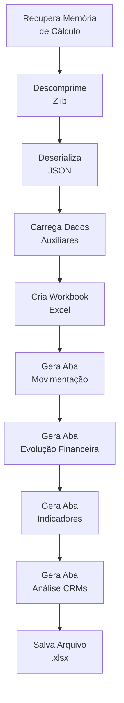

# Fase 3: Geração de Relatórios

Após o término da análise de um CNPJ na Fase 2, o sistema aciona a Fase 3 para gerar a **documentação de saída**. O objetivo não é apenas apresentar dados, mas **contar a história** da movimentação de estoque de cada medicamento, destacando as inconsistências de forma inequívoca.

---

## 1. Visão Geral

### 1.1. Objetivo

Transformar os dados processados em **dossiês de auditoria** formatados em Excel, prontos para análise humana e ações de controle.

### 1.2. Scripts Envolvidos

| Script                         | Função                                                     |
| ------------------------------ | ---------------------------------------------------------- |
| `gerar_relatorio_memoriav8.py` | Gera relatórios a partir da memória de cálculo salva       |
| `aba_crm.py`                   | Módulo especializado para a aba de análise de prescritores |

### 1.3. Modos de Execução

O sistema pode gerar relatórios de duas formas:

=== "Durante o Processamento"

    O relatório é gerado automaticamente ao final do processamento de cada CNPJ na Fase 2.

=== "Sob Demanda"

    O script pode ser executado independentemente para regenerar relatórios:

    ```bash
    python gerar_relatorio_memoriav8.py <CNPJ> [tipo]
    ```

    Onde `tipo` pode ser:

    - `1` = Relatório Completo
    - `2` = Relatório Resumido

---

## 2. O Motor de Relatórios

### 2.1. Função Principal: gerarRelatorioMovimentacao

Esta função é o **núcleo** da geração de relatórios. Ela orquestra a transformação dos dados em planilhas Excel formatadas.

### 2.2. Tecnologias Utilizadas

| Biblioteca   | Uso                                                |
| ------------ | -------------------------------------------------- |
| `pandas`     | Manipulação de dados tabulares                     |
| `xlsxwriter` | Criação de planilhas Excel com formatação avançada |
| `zlib`       | Descompressão da memória de cálculo                |
| `json`       | Deserialização dos dados                           |

### 2.3. Fluxo de Geração



---

## 3. Tipos de Relatório

### 3.1. Relatório Completo (Tipo 1)

Contém **todo o histórico transacional** da farmácia no período analisado.

| Característica | Descrição                                             |
| -------------- | ----------------------------------------------------- |
| **Conteúdo**   | Todas as movimentações, com e sem irregularidades     |
| **Tamanho**    | Maior (pode ter milhares de linhas)                   |
| **Uso**        | Auditorias fiscais completas, investigações profundas |
| **Público**    | Auditores especializados                              |

### 3.2. Relatório Resumido (Tipo 2)

Contém **apenas as irregularidades detectadas**.

| Característica | Descrição                                  |
| -------------- | ------------------------------------------ |
| **Conteúdo**   | Apenas períodos com vendas sem comprovação |
| **Tamanho**    | Menor, focado                              |
| **Uso**        | Triagem rápida, priorização de casos       |
| **Público**    | Gestores, equipes de análise inicial       |

---

## 4. Aba 1: Movimentação de Estoque

Esta é a **aba analítica principal**, contendo a prova material da auditoria.

### 4.1. Estrutura do Conteúdo

```
┌─────────────────────────────────────────────────────────────┐
│  CABEÇALHO DA FARMÁCIA                                      │
│  Razão Social: FARMÁCIA EXEMPLO LTDA                        │
│  CNPJ: 12.345.678/0001-99                                   │
│  Município/UF: FLORIANÓPOLIS/SC                             │
│  Contato: (48) 3333-3333 | email@farmacia.com               │
│  Período Analisado: 01/07/2015 a 10/12/2024                 │
│  Critério Estoque Inicial: Soma das 2 últimas aquisições    │
│  (6 meses anteriores)                                       │
├─────────────────────────────────────────────────────────────┤
│  MEDICAMENTO: LOSARTANA POTASSICA 50MG (GTIN: 789123456)    │
│  Estoque Inicial: 50 caixas                                 │
│  NFs Base: NF 123 (20/06/2015) 30cx | NF 456 (25/06/2015)   │
│  20cx                                                       │
├─────────────────────────────────────────────────────────────┤
│  Período  │ Est.Ini │ Vendas │ Est.Fin │ S/Comprov │ Notas  │
├─────────────────────────────────────────────────────────────┤
│  Jul/2015 │    50   │   45   │    5    │     0     │        │
│  Ago/2015 │     5   │   30   │    0    │    25     │   ⚠️   │
│  ...      │   ...   │  ...   │   ...   │   ...     │  ...   │
└─────────────────────────────────────────────────────────────┘
```

### 4.2. Colunas Principais

| Coluna                     | Descrição                                         |
| -------------------------- | ------------------------------------------------- |
| **Período**                | Data da movimentação (mês/ano ou data específica) |
| **Estoque Inicial**        | Quantidade em estoque no início do período        |
| **Vendas Período**         | Quantidade vendida no período                     |
| **Aquisições**             | Quantidade comprada (entrada de estoque)          |
| **Estoque Final**          | Estoque recalculado ao final do período           |
| **Vendas Sem Comprovação** | Quantidade vendida sem lastro (irregularidade)    |
| **Valor Sem Comprovação**  | Valor monetário da irregularidade                 |
| **Notas**                  | NFs de aquisição que deram lastro ao estoque      |

### 4.3. A Coluna "Notas" - Rastreabilidade

!!! success "Diferencial Técnico"
Esta coluna é o **diferencial técnico** do relatório. O script varre o histórico para trás e lista, em cada venda, exatamente **quais Notas Fiscais** deram lastro para aquele estoque.

    **Exemplo:** `NF Aquisição: 12345 - 29/09/2021 | Qtde: 50`

    Se a venda não tiver lastro, esta coluna evidencia a **falha de cobertura**.

### 4.4. Destaque Visual

| Situação                 | Formatação                              |
| ------------------------ | --------------------------------------- |
| Período normal           | Fundo branco                            |
| Cabeçalho do produto     | Fundo cinza                             |
| Linha com irregularidade | Fundo vermelho claro, texto em vermelho |
| Totais                   | Fundo azul escuro, texto branco         |

### 4.5. Seções da Aba

Para cada medicamento (GTIN):

1. **Header do Produto** - Nome, princípio ativo, estoque inicial, NFs base
2. **Títulos das Colunas** - Cabeçalho da tabela
3. **Linhas de Movimentação** - Uma linha por período de venda
4. **Sumário do Produto** - Totais do medicamento

Ao final:

5. **Total Geral** - Soma de todos os medicamentos da farmácia

---

## 5. Aba 2: Evolução Financeira

Focada na **visão gerencial**, permitindo identificar quando a fraude começou e sua intensidade ao longo do tempo.

### 5.1. Estrutura

```
┌─────────────────────────────────────────────────────────────┐
│  RESUMO FINANCEIRO                                          │
│  Total de Vendas: R$ 1.500.000,00                          │
│  Total Irregular: R$ 450.000,00 (30%)                      │
├─────────────────────────────────────────────────────────────┤
│  TABELA SEMESTRAL                                           │
│  ┌─────────┬────────────┬────────────┬─────────┐           │
│  │Semestre │   Regular  │  Irregular │    %    │           │
│  ├─────────┼────────────┼────────────┼─────────┤           │
│  │ 2015-S2 │  R$ 50.000 │  R$  5.000 │  10,0%  │           │
│  │ 2016-S1 │  R$ 80.000 │  R$ 15.000 │  18,8%  │           │
│  │ ...     │    ...     │    ...     │   ...   │           │
│  └─────────┴────────────┴────────────┴─────────┘           │
├─────────────────────────────────────────────────────────────┤
│  GRÁFICOS                                                   │
│  [Gráfico de Barras Empilhadas]                            │
│  [Gráfico de Área - Tendência de Irregularidades]          │
└─────────────────────────────────────────────────────────────┘
```

### 5.2. Conteúdo

#### 5.2.1. Tabela Semestral

Agrega o volume financeiro por semestre:

| Coluna                 | Descrição                                |
| ---------------------- | ---------------------------------------- |
| **Semestre**           | Período (ex: 2023-S1)                    |
| **Vendas Regulares**   | Valor das vendas com lastro              |
| **Vendas Irregulares** | Valor das vendas sem comprovação         |
| **% Irregularidade**   | Percentual de irregularidade no semestre |

#### 5.2.2. Cards de Resumo

| Card                          | Conteúdo                          |
| ----------------------------- | --------------------------------- |
| **Total Irregular Acumulado** | Soma de todas as irregularidades  |
| **% Média de Irregularidade** | Percentual médio no período       |
| **Tendência**                 | Crescente, estável ou decrescente |

#### 5.2.3. Gráficos

| Gráfico               | Tipo        | Finalidade                               |
| --------------------- | ----------- | ---------------------------------------- |
| **Barras Empilhadas** | Comparativo | Visualizar proporção regular × irregular |
| **Área**              | Tendência   | Destacar evolução das irregularidades    |

---

## 6. Aba 3: Indicadores de Risco & Fraude

Esta aba contextualiza a farmácia auditada em relação ao mercado, utilizando a **Matriz de Risco**.

### 6.1. Estrutura

```
┌─────────────────────────────────────────────────────────────┐
│  PAINEL DE SCORE                                            │
│  ┌─────────────────────────────────────────────────────┐   │
│  │  SCORE DE RISCO: 7.8        CLASSIFICAÇÃO: CRÍTICO  │   │
│  └─────────────────────────────────────────────────────┘   │
├─────────────────────────────────────────────────────────────┤
│  RANKINGS                                                   │
│  Nacional: 234º de 34.000 (Top 1%)                         │
│  Estadual: 12º de 850 (Top 2%)                             │
│  Municipal: 3º de 45 (Top 7%)                              │
├─────────────────────────────────────────────────────────────┤
│  CONTEXTO DEMOGRÁFICO                                       │
│  Município: FLORIANÓPOLIS/SC                               │
│  População: 508.826 habitantes                             │
│  Farmácias no Município: 45                                │
│  Habitantes por Farmácia: 11.307                           │
├─────────────────────────────────────────────────────────────┤
│  TABELA DE INDICADORES (17 métricas)                       │
│  ┌────────────────┬─────────┬─────────┬─────────┬──────┐   │
│  │   Indicador    │ Farmácia│ Média UF│ Média BR│ Risco│   │
│  ├────────────────┼─────────┼─────────┼─────────┼──────┤   │
│  │ % Falecidos    │   2,5%  │   0,1%  │   0,1%  │ ALTO │   │
│  │ Ticket Médio   │  R$ 180 │  R$ 85  │  R$ 90  │ ALTO │   │
│  │ ...            │   ...   │   ...   │   ...   │ ...  │   │
│  └────────────────┴─────────┴─────────┴─────────┴──────┘   │
├─────────────────────────────────────────────────────────────┤
│  TOP 15 MAIORES RISCOS NO MUNICÍPIO                        │
└─────────────────────────────────────────────────────────────┘
```

### 6.2. Painel de Score

| Elemento           | Descrição                               |
| ------------------ | --------------------------------------- |
| **Score de Risco** | Nota de 0 a 10+ baseada nos indicadores |
| **Classificação**  | CRÍTICO, ALTO, MÉDIO, BAIXO ou MÍNIMO   |
| **Barra Visual**   | Gradiente de cor indicando o nível      |

### 6.3. Rankings Comparativos

| Nível         | Descrição                                  |
| ------------- | ------------------------------------------ |
| **Nacional**  | Posição entre todas as farmácias do Brasil |
| **Estadual**  | Posição entre farmácias da mesma UF        |
| **Municipal** | Posição entre farmácias do mesmo município |

### 6.4. Grupos de Indicadores

Os 17 indicadores são organizados em 5 grupos:

| Grupo                       | Indicadores                                                   |
| --------------------------- | ------------------------------------------------------------- |
| **Elegibilidade & Clínica** | Falecidos, Incompatibilidade Clínica                          |
| **Padrões de Quantidade**   | Teto Máximo, Polimedicamentos, Média de Itens                 |
| **Padrões Financeiros**     | Ticket Médio, Per Capita, Alto Custo, Receita/Paciente        |
| **Automação & Geografia**   | Vendas Rápidas, Madrugada, Pico, Geográfico, Pacientes Únicos |
| **Integridade Médica**      | HHI, Exclusividade CRM, Irregularidade CRM                    |

### 6.5. Explicações Metodológicas

!!! info "Detalhamento"
Para cada indicador, uma célula de comentário explica a **metodologia de cálculo** e a **interpretação** do resultado. Isso garante que o auditor entenda o significado de cada métrica.

---

## 7. Aba 4: Análise de Prescritores (CRMs)

Gerada pelo módulo especializado `aba_crm.py`, esta seção foca na **"ponta da caneta"** - os médicos vinculados às vendas.

### 7.1. Cards de Anomalia

Painel visual no topo da aba que alerta para situações críticas:

| Card                   | Métrica                         | Alerta             |
| ---------------------- | ------------------------------- | ------------------ |
| **Concentração Top 1** | % vendas do principal médico    | >50% = Alto        |
| **Concentração Top 5** | % vendas dos 5 maiores          | >80% = Alto        |
| **Prescritores Robô**  | Médicos com >30 prescrições/dia | Qualquer = Crítico |
| **CRMs Inválidos**     | Médicos não encontrados no CFM  | Qualquer = Crítico |
| **Alerta Geográfico**  | Prescritores a >400km           | Qualquer = Médio   |

### 7.2. Tabela de Indicadores de Risco

Compara métricas de CRM da farmácia com médias estaduais e nacionais:

| Indicador          | Farmácia | Média UF | Média BR | Risco   |
| ------------------ | -------- | -------- | -------- | ------- |
| Concentração Top 1 | 35%      | 15%      | 12%      | ALTO    |
| Índice HHI         | 2845     | 890      | 750      | ALTO    |
| % CRMs Inválidos   | 5%       | 0.5%     | 0.3%     | CRÍTICO |

### 7.3. Tabela de CRMs de Interesse

Lista os **principais prescritores** ordenados por risco/volume:

| Coluna                   | Descrição                                      |
| ------------------------ | ---------------------------------------------- |
| **Rank**                 | Posição por volume de vendas                   |
| **CRM**                  | Número do registro médico                      |
| **Nome do Médico**       | Nome completo                                  |
| **UF do CRM**            | Estado de registro                             |
| **Data 1ª Prescrição**   | Primeira vez que prescreveu para esta farmácia |
| **Data Registro CFM**    | Data de inscrição no conselho                  |
| **Nº Prescrições**       | Total de prescrições                           |
| **Valor (R$)**           | Valor total movimentado                        |
| **% Participação**       | Percentual das vendas da farmácia              |
| **Prescrições/Dia Aqui** | Média diária nesta farmácia                    |
| **Prescrições/Dia BR**   | Média diária em todas farmácias                |
| **Nº Farmácias**         | Em quantas farmácias atua                      |
| **Alertas**              | Flags de risco                                 |

### 7.4. Flags de Alerta

| Flag                      | Critério                                 | Cor         |
| ------------------------- | ---------------------------------------- | ----------- |
| **CRM Inválido**          | Não encontrado no CFM                    | 🔴 Vermelho |
| **>30/dia Aqui**          | >30 prescrições/dia nesta farmácia       | 🔴 Magenta  |
| **>30/dia Rede**          | >30 prescrições/dia em todas farmácias   | 🟣 Roxo     |
| **Multi-Farmácia**        | Atua em >20 estabelecimentos             | 🟣 Roxo     |
| **Tempo Concentrado**     | Todas prescrições em período muito curto | 🟠 Laranja  |
| **Alerta Geográfico**     | Prescritor a >400km da farmácia          | 🔵 Azul     |
| **Prescrição Retroativa** | Prescrição antes do registro no CFM      | 🔴 Vermelho |

### 7.5. Seção de Alertas Identificados

Ao final da aba, uma seção consolida e descreve os alertas encontrados com texto explicativo:

```
ALERTAS IDENTIFICADOS:

⚠️ CRM INVÁLIDO: O médico CRM 123456/SP não foi localizado na base
   do Conselho Federal de Medicina. Vendas vinculadas: R$ 45.000,00.

⚠️ PRESCRITOR ROBÔ: O médico Dr. João Silva (CRM 789012/SC) apresentou
   média de 45 prescrições por dia nesta farmácia, volume incompatível
   com a prática médica regular.
```

---

## 8. Formatação Profissional

### 8.1. Recursos do xlsxwriter

O poder do xlsxwriter é usado para dar **acabamento profissional**:

| Recurso                     | Aplicação                             |
| --------------------------- | ------------------------------------- |
| **Cores**                   | Paleta institucional, alertas por cor |
| **Fontes**                  | Calibri 11pt, negrito para títulos    |
| **Bordas**                  | Grid completo nas tabelas             |
| **Largura de Colunas**      | Ajuste automático para evitar corte   |
| **Mesclagem de Células**    | Títulos e cabeçalhos                  |
| **Congelamento de Painéis** | Cabeçalhos fixos durante rolagem      |
| **Gráficos**                | Barras, área, pizza (aba Evolução)    |
| **Comentários**             | Explicações metodológicas             |
| **Formatação Condicional**  | Cores baseadas em valores             |

### 8.2. Paleta de Cores

| Código    | Uso                                 |
| --------- | ----------------------------------- |
| `#1F4E78` | Azul escuro - cabeçalhos principais |
| `#E8F4FD` | Azul claro - linhas alternadas      |
| `#FFCCCC` | Vermelho claro - irregularidades    |
| `#D4EDDA` | Verde claro - situações normais     |
| `#FFF3CD` | Amarelo - alertas moderados         |
| `#EEEEEE` | Cinza - cabeçalhos de produto       |

---

## 9. Nomenclatura dos Arquivos

### 9.1. Padrão de Nome

```
<CNPJ> (<Tipo>).xlsx
```

Exemplos:

- `12345678000199 (Completo).xlsx`
- `12345678000199 (Resumido).xlsx`

### 9.2. Localização

Os arquivos são salvos no mesmo diretório do script, ou em pasta configurada.

---

!!! tip "Próximo Passo"
Veja a [Fase 4: Análise Gerencial](fase4-analise.md) para entender como os indicadores de risco são calculados.
