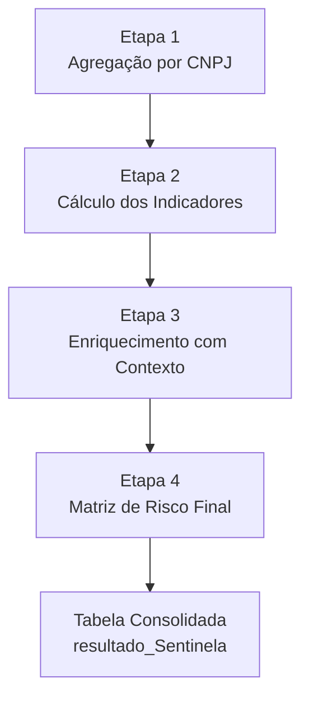
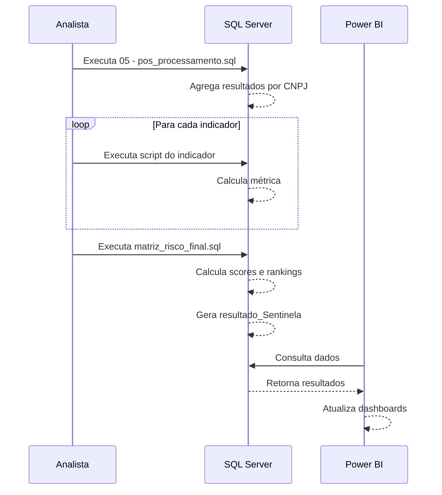

# Fase 4: Análise Gerencial

O objetivo desta fase é sair da visão micro (transação a transação, CNPJ por CNPJ) e chegar a uma **visão macro e comparativa**. Ela agrega os resultados e calcula métricas padronizadas que permitem classificar e comparar o comportamento de todas as farmácias auditadas.

---

## 1. Visão Geral

### 1.1. Objetivo

Consolidar os resultados da auditoria de fluxo de estoque e calcular os **17 indicadores de risco** para cada farmácia.

### 1.2. Script Principal

```
📄 05 - pos_processamento.sql
📁 Indicadores/ (22 scripts SQL)
📄 Indicadores/matriz_risco_final.sql
```

### 1.3. Diagrama de Fluxo



---

## 2. Etapa 1: Agregação dos Resultados Brutos por Farmácia

### 2.1. O que faz

Cria a tabela temporária `#movimentacao_gerencial_temp` com os **totais consolidados** de cada farmácia.

### 2.2. Como funciona

Realiza agregação (`SUM()`) sobre a tabela `movimentacaoMensalCodigoBarraFP`, que contém os totais mensais por produto.

### 2.3. Campos Agregados

| Campo Original               | Agregação | Campo Resultado             |
| ---------------------------- | --------- | --------------------------- |
| `qnt_vendas`                 | `SUM()`   | Total de vendas em unidades |
| `qnt_vendas_sem_comprovacao` | `SUM()`   | Total irregular em unidades |
| `valor_vendas`               | `SUM()`   | Faturamento total           |
| `valor_sem_comprovacao`      | `SUM()`   | Valor total irregular       |

### 2.4. Resultado

Uma única linha de resumo para cada farmácia, contendo os totais gerais da auditoria.

---

## 3. Etapa 2: Cálculo dos Indicadores de Risco

Esta é a etapa mais rica, onde diferentes comportamentos potencialmente fraudulentos são **medidos e quantificados**.

### 3.1. Estrutura dos Scripts

Cada indicador possui um script SQL dedicado na pasta `Indicadores/`:

```
📁 Indicadores/
├── falecidos.sql
├── inconsistencia_clinica.sql
├── teto.sql
├── polimedicamento.sql
├── media_itens.sql
├── tickermedio.sql
├── receita_por_paciente.sql
├── venda_per_capita.sql
├── medicamentos_alto_custo.sql
├── vendas_consecutivas.sql
├── horario_atipico.sql
├── concentracao_dias_pico.sql
├── geografico.sql
├── pacientes_unicos.sql
├── crms.sql
├── exclusividade_crm.sql
├── crms_irregulares.sql
└── matriz_risco_final.sql
```

### 3.2. Visão Geral dos 17 Indicadores

| #   | Indicador                 | Grupo         | Script                        |
| --- | ------------------------- | ------------- | ----------------------------- |
| 1   | Vendas para Falecidos     | Elegibilidade | `falecidos.sql`               |
| 2   | Incompatibilidade Clínica | Elegibilidade | `inconsistencia_clinica.sql`  |
| 3   | Dispensação em Teto       | Quantidade    | `teto.sql`                    |
| 4   | Polimedicamentos          | Quantidade    | `polimedicamento.sql`         |
| 5   | Média de Itens            | Quantidade    | `media_itens.sql`             |
| 6   | Ticket Médio              | Financeiro    | `tickermedio.sql`             |
| 7   | Receita por Paciente      | Financeiro    | `receita_por_paciente.sql`    |
| 8   | Venda Per Capita          | Financeiro    | `venda_per_capita.sql`        |
| 9   | Medicamentos Alto Custo   | Financeiro    | `medicamentos_alto_custo.sql` |
| 10  | Vendas Rápidas            | Automação     | `vendas_consecutivas.sql`     |
| 11  | Horário Atípico           | Automação     | `horario_atipico.sql`         |
| 12  | Concentração em Pico      | Automação     | `concentracao_dias_pico.sql`  |
| 13  | Dispersão Geográfica      | Automação     | `geografico.sql`              |
| 14  | Pacientes Únicos          | Automação     | `pacientes_unicos.sql`        |
| 15  | Concentração HHI          | CRMs          | `crms.sql`                    |
| 16  | Exclusividade CRM         | CRMs          | `exclusividade_crm.sql`       |
| 17  | Irregularidade CRM        | CRMs          | `crms_irregulares.sql`        |

---

## 4. Etapa 3: Enriquecimento com Contexto

### 4.1. O que faz

Adiciona **informações contextuais** que permitem interpretar os números absolutos.

### 4.2. Métricas de Contexto

| Métrica                          | Descrição                 | Uso                   |
| -------------------------------- | ------------------------- | --------------------- |
| `num_estabelecimentos_municipio` | Farmácias na mesma cidade | Avaliar saturação     |
| `num_meses_movimentacao`         | Meses com atividade       | Avaliar consistência  |
| `populacao_municipio`            | População local (IBGE)    | Calcular per capita   |
| `porte_empresa`                  | MEI, ME, EPP, etc.        | Contextualizar volume |

### 4.3. Por que o contexto importa

!!! info "Exemplo"
Uma farmácia com 50% de irregularidade em uma cidade com apenas 2 estabelecimentos pode ter um significado diferente de uma com o mesmo percentual em uma metrópole com 500 farmácias.

    Um padrão observado ao longo de 48 meses é mais robusto do que um observado em apenas 3 meses.

---

## 5. Etapa 4: Matriz de Risco Final

### 5.1. Script Principal

```
📄 Indicadores/matriz_risco_final.sql
```

### 5.2. Consolidação dos Indicadores

Este script é a **etapa final** que:

1. Une todos os indicadores calculados individualmente
2. Calcula o Score de Risco Final
3. Gera a classificação e os rankings
4. Cria a tabela `Matriz_Risco_Final`

### 5.3. Cálculo do Score de Risco

O Score é calculado através da **Média Aritmética dos Riscos Relativos**:

#### Passo 1: Normalização (Risco Relativo)

Para cada indicador, calcula-se o risco da farmácia em relação à média do seu estado:

$$
RR_i = \frac{\text{Indicador da Farmácia}_i}{\text{Média do Indicador na UF}_i}
$$

!!! warning "Tratamento de Exceção"
Se a média da UF for zero, utiliza-se um valor default para evitar divisão por zero.

#### Passo 2: Cálculo do Score Geral

$$
\text{SCORE\_FINAL} = \frac{\sum_{i=1}^{17} RR_i}{17}
$$

### 5.4. Classificação de Risco (Percentil)

Após calcular o Score para todas as farmácias, aplica-se uma função de janelamento (`PERCENT_RANK()`) para distribuir os estabelecimentos em faixas:

| Classificação        | Percentil  | Descrição           |
| -------------------- | ---------- | ------------------- |
| 🔴 **RISCO CRÍTICO** | 99% - 100% | Top 1% do ranking   |
| 🟠 **RISCO ALTO**    | 95% - 99%  | Top 5% do ranking   |
| 🟡 **RISCO MÉDIO**   | 75% - 95%  | Quartil superior    |
| 🟢 **RISCO BAIXO**   | 25% - 75%  | Faixa intermediária |
| 🟢 **RISCO MÍNIMO**  | 0% - 25%   | Quartil inferior    |

### 5.5. Rankings

São calculados três rankings:

| Ranking       | Escopo                       | Uso                 |
| ------------- | ---------------------------- | ------------------- |
| **Nacional**  | Todas as farmácias do Brasil | Priorização geral   |
| **Estadual**  | Farmácias da mesma UF        | Comparação regional |
| **Municipal** | Farmácias do mesmo município | Análise local       |

---

## 6. Tabela de Resultado Consolidado

### 6.1. Tabela Final

```
📊 temp_CGUSC.dbo.resultado_Sentinela_2015_2024
```

### 6.2. O que contém

Esta é a **visão de 360 graus** de cada farmácia auditada:

| Categoria                | Campos                                            |
| ------------------------ | ------------------------------------------------- |
| **Identificação**        | CNPJ, Razão Social, Município, UF                 |
| **Resultados Auditoria** | Valor total, Valor irregular, Quantidades         |
| **Indicadores**          | Todos os 17 indicadores individuais               |
| **Contexto**             | Porte, farmácias no município, meses de atividade |
| **Score e Ranking**      | Score final, classificação, rankings              |
| **Demográfico**          | População, habitantes por farmácia                |

### 6.3. Uso da Tabela

Esta tabela permite perguntas complexas e multifatoriais:

!!! example "Exemplo de Consulta"
"Quais são as farmácias de **pequeno porte**, em municípios com **menos de 50.000 habitantes**, que apresentam um **percentual de vendas sem comprovação acima de 15%** E um **indicador de vendas para falecidos maior que zero**?"

É a partir desta tabela consolidada que são criados:

- Dashboards
- Relatórios gerenciais
- Seleção de alvos para auditorias presenciais

---

## 7. Integração com o Painel BI

### 7.1. Queries do Painel

```
📄 06 - SQLs_Sentinela_BI.sql
```

Este arquivo contém as queries utilizadas para alimentar o painel Power BI.

### 7.2. Bases de Dados Utilizadas

O painel integra dados de múltiplas fontes:

| Base                 | Uso no Painel                |
| -------------------- | ---------------------------- |
| `db_Cadunico`        | Dados de beneficiários       |
| `db_CPF`             | Dados cadastrais de pessoas  |
| `db_CNPJ`            | Dados cadastrais de empresas |
| `db_FarmaciaPopular` | Transações do programa       |
| `db_Dike_CNPJ`       | Dados enriquecidos           |
| `temp_CGUSC`         | Resultados da auditoria      |

### 7.3. Link do Painel

🔗 **[https://paineis.cgu.gov.br/sentinela](https://paineis.cgu.gov.br/sentinela)**

---

## 8. Tabelas Temporárias do Processo

Durante a Fase 4, são criadas diversas tabelas temporárias:

| Tabela                           | Descrição                         |
| -------------------------------- | --------------------------------- |
| `#movimentacao_gerencial_temp`   | Agregação inicial por CNPJ        |
| `#movimentacao_gerencial_temp2`  | Com dados cadastrais              |
| `#movimentacao_gerencial_temp3`  | Com métricas de contexto          |
| `#vendas_falecidos`              | Cálculo do indicador de falecidos |
| `#vendas_total`                  | Denominador para percentuais      |
| `#indicadorTicketMedio`          | Cálculo do ticket médio           |
| `#indicadorMedicamentosporCupom` | Média de itens                    |
| ...                              | (uma para cada indicador)         |

---

## 9. Fluxo Completo de Execução



---

!!! tip "Próximo Passo"
Explore os [Indicadores de Risco](../indicadores/index.md) para entender a metodologia detalhada de cada métrica.
