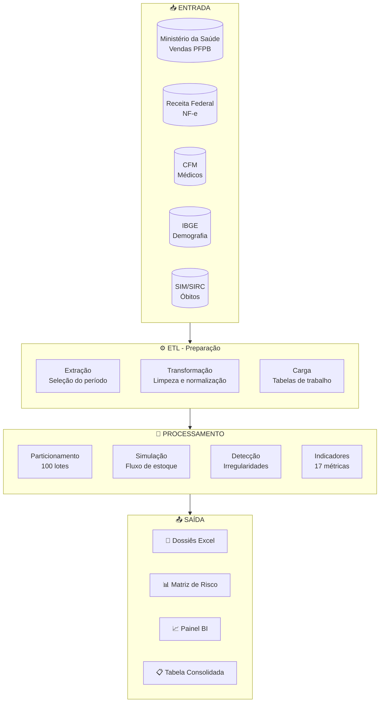
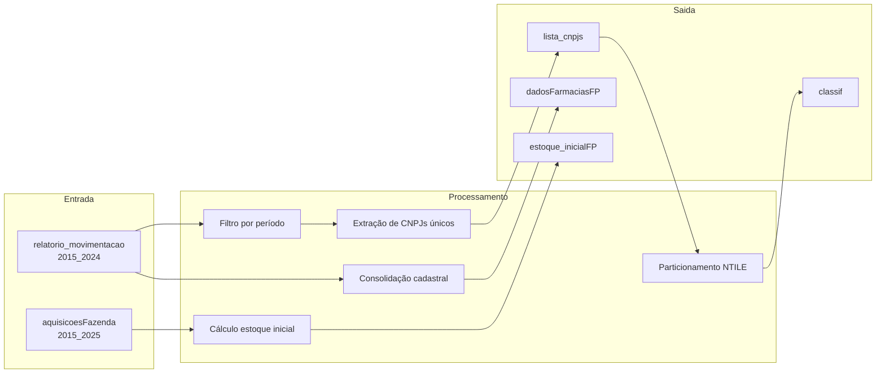
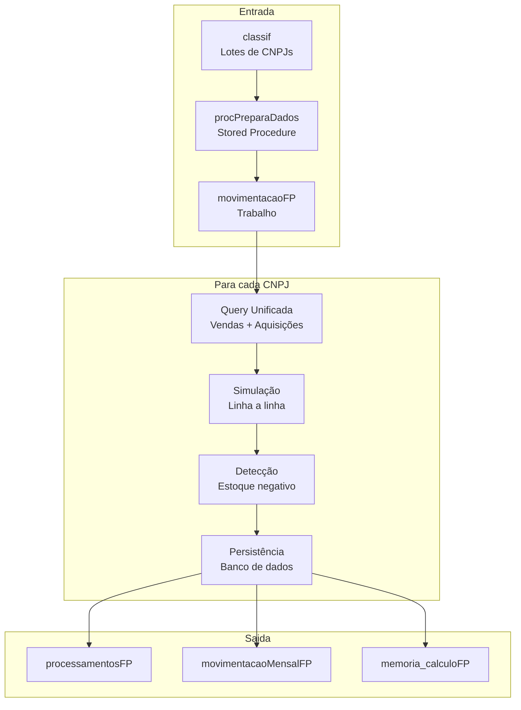
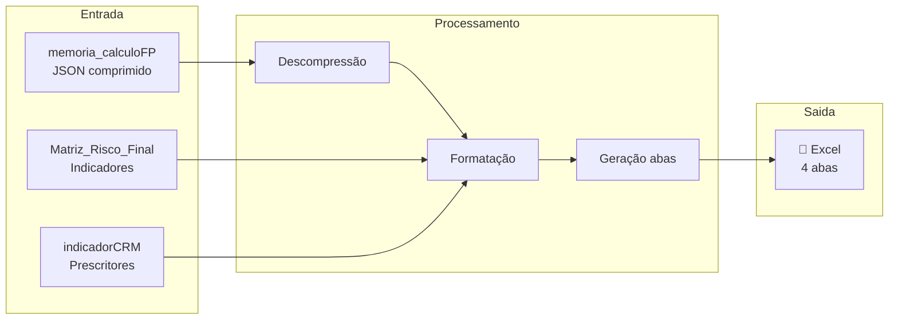
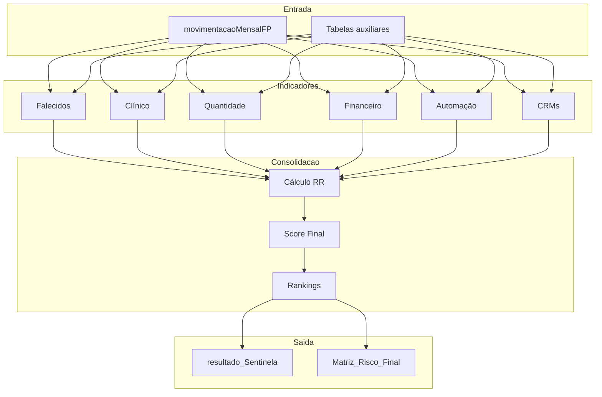
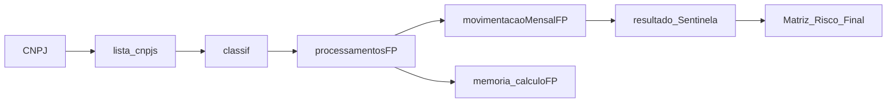
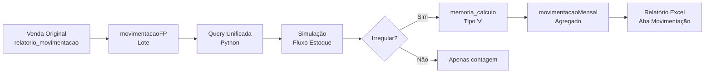

# Fluxo de Dados

Este documento apresenta uma visão integrada de como os dados fluem através do Sistema Sentinela, desde a entrada até a geração dos produtos finais.

---

## 1. Visão Geral do Pipeline

---

## 2. Fluxo Detalhado por Fase

### 2.1. Fase 1: Preparação (SQL)

### 2.2. Fase 2: Processamento (Python)

### 2.3. Fase 3: Relatórios (Python)

### 2.4. Fase 4: Análise Gerencial (SQL)

---

## 3. Mapa de Tabelas

### 3.1. Tabelas de Entrada (Leitura)

| Tabela                           | Base                  | Tipo         | Linhas (est.)       |
| -------------------------------- | --------------------- | ------------ | ------------------- |
| relatorio_movimentacao_2015_2024 | db_farmaciapopular    | Transacional | Bilhões             |
| aquisicoesFazenda_2015_2025      | db_farmaciapopular_nf | Transacional | Centenas de milhões |
| tb_obitos_unificada              | Múltiplas             | Referência   | Milhões             |
| CNPJ                             | db_CNPJ               | Referência   | Milhões             |
| CPF                              | db_CPF                | Referência   | Centenas de milhões |

### 3.2. Tabelas de Trabalho (Temporárias)

| Tabela         | Função                   | Vida Útil     |
| -------------- | ------------------------ | ------------- |
| classif        | Particionamento de CNPJs | Toda execução |
| movimentacaoFP | Dados do lote atual      | Um lote       |
| #temp\_\*      | Cálculos intermediários  | Uma query     |

### 3.3. Tabelas de Saída (Persistência)

| Tabela                          | Função              | Atualização |
| ------------------------------- | ------------------- | ----------- |
| processamentosFP                | Status de cada CNPJ | Por CNPJ    |
| movimentacaoMensalCodigoBarraFP | Movimentação mensal | Por CNPJ    |
| memoria_calculo_consolidadaFP   | Memória de cálculo  | Por CNPJ    |
| resultado_Sentinela_2015_2024   | Consolidação final  | Uma vez     |
| Matriz_Risco_Final              | Scores e rankings   | Uma vez     |

---

## 4. Fluxo de Dados por Campo

### 4.1. Rastreabilidade de um CNPJ

### 4.2. Rastreabilidade de uma Venda

---

## 5. Integrações Externas

### 5.1. Entrada de Dados

| Fonte               | Frequência  | Método        |
| ------------------- | ----------- | ------------- |
| Ministério da Saúde | Periódica   | Carga em base |
| Receita Federal     | Periódica   | Carga em base |
| CFM                 | Sob demanda | API/Arquivo   |
| IBGE                | Anual       | Carga em base |
| Bases de Óbitos     | Periódica   | Carga em base |

### 5.2. Saída de Dados

| Destino        | Formato     | Método              |
| -------------- | ----------- | ------------------- |
| Arquivos Excel | .xlsx       | Geração local       |
| Painel BI      | Power BI    | Conexão DirectQuery |
| Auditorias     | Tabelas SQL | Acesso direto       |

---

## 6. Pontos de Verificação

### 6.1. Após Fase 1

- [ ] `lista_cnpjs` populada com CNPJs únicos
- [ ] `classif` com 100 lotes balanceados
- [ ] `estoque_inicialFP` calculado para cada produto/farmácia
- [ ] Coordenadas geográficas atualizadas

### 6.2. Após Fase 2

- [ ] Todos os CNPJs com status != RUNNING
- [ ] `movimentacaoMensalFP` populada
- [ ] `memoria_calculo` salva para CNPJs com irregularidades
- [ ] Relatórios Excel gerados

### 6.3. Após Fase 4

- [ ] Todos os indicadores calculados
- [ ] `resultado_Sentinela` consolidado
- [ ] `Matriz_Risco_Final` com scores e rankings
- [ ] Painel BI atualizado

---

!!! tip "Próximo Passo"
Veja o [Guia de Execução](../execucao/guia-execucao.md) para instruções detalhadas de como executar cada fase.
