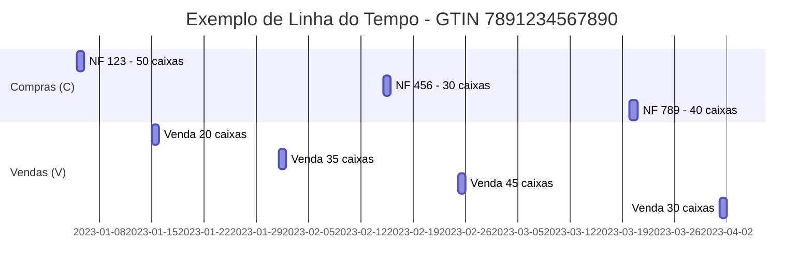

# Fontes de Dados Primárias

No centro de toda a análise do Sistema Sentinela estão **duas tabelas transacionais principais**. Elas representam os dois lados da balança que a auditoria busca equilibrar: **o que a farmácia comprou** e **o que ela vendeu**.

---

## 1. Tabela de Saídas: Vendas do Programa Farmácia Popular

### 1.1. Identificação

| Atributo           | Valor                                                |
| ------------------ | ---------------------------------------------------- |
| **Nome da Tabela** | `[dbo].[relatorio_movimentacao_2015_2024]`           |
| **Base de Dados**  | `db_farmaciapopular`                                 |
| **Fonte Original** | Sistema Autorizador do Ministério da Saúde           |
| **Tipo**           | Transacional                                         |
| **Granularidade**  | Um registro por item vendido                         |

### 1.2. Descrição

Esta tabela contém o **registro de todas as vendas** realizadas pelas farmácias dentro do programa Farmácia Popular. Cada linha representa um **item vendido em uma transação**.

!!! info "Papel no Sistema"
Ela representa o **fluxo de saída (outflow)** de medicamentos do estoque. É o conjunto de dados que está sendo auditado. No processo de análise da Fase 2, os registros desta tabela são marcados como transações do tipo **'V' (Venda)**.

### 1.3. Campos Principais

| Campo              | Tipo          | Descrição                                                          |
| ------------------ | ------------- | ------------------------------------------------------------------ |
| `cnpj`             | VARCHAR(14)   | CNPJ da farmácia que realizou a venda                              |
| `data_hora`        | DATETIME      | Momento exato da transação (data e hora)                           |
| `codigo_barra`     | BIGINT        | Código GTIN do produto vendido                                     |
| `qnt_autorizada`   | INT           | Quantidade do produto vendida (geralmente em unidades/comprimidos) |
| `valor_autorizado` | DECIMAL(10,2) | Valor da venda autorizada                                          |
| `valor_pago`       | DECIMAL(10,2) | Valor efetivamente pago/ressarcido                                 |
| `num_autorizacao`  | BIGINT        | Número único da autorização (cupom fiscal)                         |
| `nu_cpf`           | VARCHAR(11)   | CPF do beneficiário que recebeu o medicamento                      |
| `id_medico`        | VARCHAR(20)   | CRM do médico prescritor                                           |

### 1.4. Volume de Dados

!!! warning "Atenção"
Esta tabela contém **bilhões de registros** cobrindo quase uma década de transações. Consultas diretas sem filtros adequados podem impactar a performance do servidor.

### 1.5. Como é Utilizada

1. **Fase 1 (Preparação):** Define o universo de CNPJs a serem analisados
2. **Fase 2 (Processamento):** Fornece os registros de venda para simulação de estoque
3. **Fase 4 (Análise):** Base para cálculo de indicadores comportamentais

---

## 2. Tabela de Entradas: Aquisições por Nota Fiscal

### 2.1. Identificação

| Atributo           | Valor                                         |
| ------------------ | --------------------------------------------- |
| **Nome da Tabela** | `[dbo].[aquisicoesFazenda_2015_2025]`         |
| **Base de Dados**  | `db_farmaciapopular_nf`                       |
| **Fonte Original** | Nota Fiscal Eletrônica (SPED/Receita Federal) |
| **Tipo**           | Transacional                                  |
| **Granularidade**  | Um registro por item da nota fiscal           |

### 2.2. Descrição

Esta tabela contém os dados extraídos das **Notas Fiscais Eletrônicas (NF-e)** que registram a compra de medicamentos pelas farmácias junto aos seus distribuidores.

!!! success "Papel no Sistema"
Ela representa o **fluxo de entrada (inflow)** de medicamentos no estoque e serve como a **"comprovação" legal** da aquisição. É contra esta base de dados que as vendas são comparadas. No processo de análise, os registros desta tabela são marcados como transações do tipo **'C' (Compra)**.

### 2.3. Campos Principais

| Campo             | Tipo        | Descrição                                       |
| ----------------- | ----------- | ----------------------------------------------- |
| `destinatarioNFE` | VARCHAR(14) | CNPJ da farmácia que comprou o medicamento      |
| `dataEmissaoNFE`  | DATE        | Data de emissão da nota fiscal (data da compra) |
| `codigoBarra`     | BIGINT      | Código GTIN do produto comprado                 |
| `quantidade`      | INT         | Quantidade adquirida (geralmente em caixas)     |
| `numeroNFE`       | BIGINT      | Número da nota fiscal para rastreabilidade      |
| `tipoOperacao`    | INT         | Natureza da transação fiscal                    |
| `emitenteNFE`     | VARCHAR(14) | CNPJ do fornecedor/distribuidor                 |

### 2.4. Tipos de Operação

O campo `tipoOperacao` é crucial para diferenciar a natureza da transação:

| Código | Operação      | Efeito no Estoque | Descrição                                |
| ------ | ------------- | ----------------- | ---------------------------------------- |
| **1**  | Compra        | ➕ Entrada        | Aquisição regular de mercadoria          |
| **0**  | Transferência | ➖ Saída          | Transferência para outro estabelecimento |
| **-1** | Devolução     | ➖ Saída          | Devolução ao fornecedor                  |

!!! warning "Tratamento de Devoluções"
As transações com `tipoOperacao = 0` e `tipoOperacao = -1` **reduzem** o estoque, pois representam saída de mercadoria (devolução ou transferência). O sistema trata essas transações como tipo **'D' (Devolução)** na simulação de estoque.

### 2.5. Filtros Aplicados

Na query principal do sistema, apenas transações com `tipoOperacao in (1, -1, 0)` são consideradas, excluindo operações fiscais que não afetam estoque físico.

---

## 3. Cruzamento das Bases

### 3.1. A Lógica do Cruzamento

O Sistema Sentinela cruza essas duas bases para responder à pergunta fundamental:

!!! quote "Pergunta Central"
**Para cada venda registrada, existe uma aquisição correspondente que comprove a existência do produto em estoque?**

### 3.2. Criação da Linha do Tempo

Na Fase 2, o sistema cria uma **linha do tempo unificada** combinando vendas e compras:



### 3.3. Ordenação Crítica

A query de cruzamento aplica ordenação específica:

```
ORDER BY codigoBarra, data_movimentacao ASC, compra_venda ASC
```

Esta ordenação garante que:

1. **Agrupamento por produto:** Todas as transações de um mesmo GTIN são processadas juntas
2. **Ordem cronológica:** Transações são processadas na ordem em que ocorreram
3. **Compras antes de vendas:** Se houver compra e venda no mesmo dia, a compra é processada primeiro

!!! tip "Por que isso importa?"
A ordem de processamento é fundamental para a precisão da simulação. Se uma compra e uma venda ocorrem no mesmo dia, o comportamento natural é que a farmácia primeiro receba a mercadoria e depois a venda. Processar a venda antes poderia gerar um falso negativo de estoque.

---

## 4. Considerações Técnicas

### 4.1. Unidades de Medida

!!! danger "Atenção: Unidades Diferentes!"
As tabelas usam **unidades de medida diferentes**:

    - **Vendas:** `qnt_autorizada` geralmente em **unidades/comprimidos**
    - **Aquisições:** `quantidade` geralmente em **caixas**

O sistema utiliza a tabela `medicamentosPatologiaFP` para fazer a conversão:

$$
\text{Quantidade em Caixas} = \frac{\text{qnt\_autorizada}}{\text{qnt\_comprimidos\_caixa}}
$$

### 4.2. Cobertura Temporal

| Base            | Período Disponível   |
| --------------- | -------------------- |
| Vendas PFPB     | Julho/2015 em diante |
| NF-e Aquisições | 2015 em diante       |

---

!!! tip "Próximo Passo"
Veja as [Tabelas de Apoio](tabelas-apoio.md) para entender o dicionário de medicamentos e outras tabelas auxiliares.
