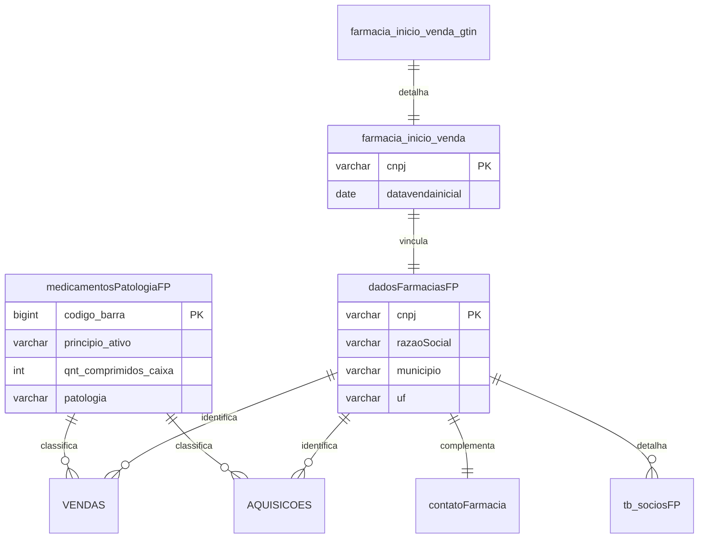

# Tabelas de Apoio

Antes de iniciar a preparação dos dados transacionais, é crucial entender as **tabelas de apoio** que servem como base de conhecimento para todo o sistema.

---

## 1. Dicionário de Medicamentos

### 1.1. Identificação

| Atributo           | Valor                                        |
| ------------------ | -------------------------------------------- |
| **Nome da Tabela** | `temp_CGUSC.dbo.medicamentosPatologiaFP`     |
| **Tipo**           | Tabela de Referência (Lookup)                |
| **Função**         | Dicionário de medicamentos elegíveis ao PFPB |

### 1.2. Descrição

Esta tabela funciona como o **Dicionário de Medicamentos** do sistema. Armazena informações detalhadas para cada código de barras (GTIN) elegível ao Programa Farmácia Popular.

!!! success "Importância Crítica"
O campo `qnt_comprimidos_caixa` é **vital** para a lógica de negócio, pois permite ao sistema **normalizar as vendas** (muitas vezes registradas em unidades/comprimidos) para a unidade de controle de estoque (caixas).

### 1.3. Estrutura de Campos

| Campo                   | Tipo         | Descrição                                   | Exemplo                      |
| ----------------------- | ------------ | ------------------------------------------- | ---------------------------- |
| `codigo_barra`          | BIGINT       | Código GTIN do medicamento (chave primária) | 7891234567890                |
| `principio_ativo`       | VARCHAR(200) | Princípio ativo do medicamento              | Budesonida 50mcg             |
| `produto`               | VARCHAR(200) | Nome comercial do medicamento               | Noex                         |
| `descricao`             | VARCHAR(500) | Descrição completa do medicamento           | Budesonida 50mcg spray nasal |
| `laboratorio`           | VARCHAR(200) | Laboratório fabricante                      | Eurofarma Laboratórios Ltda  |
| `qnt_comprimidos_caixa` | INT          | Quantidade de unidades por caixa            | 60                           |
| `patologia`             | VARCHAR(100) | Patologia para a qual é indicado            | Rinite                       |

### 1.4. Uso no Sistema

A tabela é utilizada em todas as fases do projeto:

| Fase       | Uso                                                    |
| ---------- | ------------------------------------------------------ |
| **Fase 1** | Filtrar apenas medicamentos elegíveis                  |
| **Fase 2** | Converter unidades para caixas na query principal      |
| **Fase 3** | Exibir nome do princípio ativo nos relatórios          |
| **Fase 4** | Classificar medicamentos por patologia nos indicadores |

### 1.5. Fórmula de Conversão

A conversão de unidades para caixas é feita com a seguinte fórmula:

$$
\text{Quantidade de Caixas} = \frac{\text{qnt\_autorizada}}{\text{qnt\_comprimidos\_caixa}}
$$

!!! example "Exemplo de Conversão"
**Cenário:** Venda de 120 comprimidos de um medicamento que vem em caixas de 30.

    $$
    \text{Caixas} = \frac{120}{30} = 4 \text{ caixas}
    $$

### 1.6. Geração da Tabela

A tabela é gerada pela execução do script:

```
📄 01 - medicamentosPatologiaFP.sql
```

---

## 2. Outras Tabelas de Apoio

### 2.1. Dados Cadastrais das Farmácias

| Atributo           | Valor                                              |
| ------------------ | -------------------------------------------------- |
| **Nome da Tabela** | `temp_CGUSC.dbo.dadosFarmaciasFP`                  |
| **Função**         | Consolidar informações cadastrais de cada farmácia |

#### Campos Principais

| Campo                            | Descrição                             |
| -------------------------------- | ------------------------------------- |
| `cnpj`                           | CNPJ da farmácia                      |
| `razaoSocial`                    | Razão social da empresa               |
| `nomeFantasia`                   | Nome fantasia                         |
| `municipio`                      | Município de localização              |
| `uf`                             | Unidade da Federação                  |
| `logradouro`, `numero`, `bairro` | Endereço completo                     |
| `latitude`, `longitude`          | Coordenadas geográficas               |
| `situacaoCadastral`              | Status no cadastro da Receita Federal |
| `naturezaJuridica`               | Código da natureza jurídica           |
| `porteEmpresa`                   | Porte da empresa (MEI, ME, EPP, etc.) |
| `outrasSociedades`               | Flag se sócios têm outras farmácias   |

### 2.2. Informações de Contato

| Atributo           | Valor                                   |
| ------------------ | --------------------------------------- |
| **Nome da Tabela** | `temp_CGUSC.dbo.contatoFarmacia`        |
| **Função**         | Armazenar dados de contato consolidados |

#### Campos Principais

| Campo                | Descrição                   |
| -------------------- | --------------------------- |
| `cnpj`               | CNPJ da farmácia            |
| `telefone`           | Telefone de contato         |
| `email`              | E-mail de contato           |
| `responsavelTecnico` | Nome do responsável técnico |

### 2.3. Data de Início de Venda

| Atributo           | Valor                                       |
| ------------------ | ------------------------------------------- |
| **Nome da Tabela** | `temp_CGUSC.dbo.farmacia_inicio_venda`      |
| **Função**         | Registrar a primeira venda de cada farmácia |

#### Campos Principais

| Campo              | Descrição                          |
| ------------------ | ---------------------------------- |
| `cnpj`             | CNPJ da farmácia                   |
| `datavendainicial` | Data da primeira venda no programa |

!!! info "Uso"
Esta tabela é utilizada para determinar o **ponto de partida** da análise de cada farmácia. Farmácias que iniciaram vendas após a data de corte (01/07/2015) terão sua análise iniciada na data real de início.

### 2.4. Data de Início por Produto

| Atributo           | Valor                                                       |
| ------------------ | ----------------------------------------------------------- |
| **Nome da Tabela** | `temp_CGUSC.dbo.farmacia_inicio_venda_gtin`                 |
| **Função**         | Registrar a primeira venda de cada produto em cada farmácia |

#### Campos Principais

| Campo                 | Descrição                            |
| --------------------- | ------------------------------------ |
| `cnpj`                | CNPJ da farmácia                     |
| `codigo_barra`        | GTIN do medicamento                  |
| `data_primeira_venda` | Data da primeira venda deste produto |

!!! tip "Uso"
Esta tabela é fundamental para o cálculo do **estoque inicial por produto**. O sistema busca aquisições nos 6 meses anteriores a esta data para estimar o estoque inicial.

---

## 3. Tabelas de Referência Externas

### 3.1. Cadastro de CNPJs

| Base      | Tabela       | Conteúdo                                      |
| --------- | ------------ | --------------------------------------------- |
| `db_CNPJ` | `dbo.CNPJ`   | Dados cadastrais completos da Receita Federal |
| `db_CNPJ` | `dbo.socios` | Quadro societário das empresas                |

### 3.2. Cadastro de CPFs

| Base     | Tabela    | Conteúdo                            |
| -------- | --------- | ----------------------------------- |
| `db_CPF` | `dbo.CPF` | Dados cadastrais de pessoas físicas |

### 3.3. Base de Óbitos

| Base      | Tabela                | Conteúdo                                                  |
| --------- | --------------------- | --------------------------------------------------------- |
| Múltiplas | `tb_obitos_unificada` | Registro de óbitos de diversas fontes (SIM, SIRC, SISOBI) |

### 3.4. Dados Demográficos

| Base  | Tabela    | Conteúdo                                     |
| ----- | --------- | -------------------------------------------- |
| `sus` | `tb_ibge` | População e dados demográficos por município |

### 3.5. Base de Médicos

| Base | Tabela          | Conteúdo                                             |
| ---- | --------------- | ---------------------------------------------------- |
| CFM  | Base de médicos | Registro de médicos com data de inscrição e situação |

---

## 4. Relacionamento entre Tabelas



---

!!! tip "Próximo Passo"
Veja a [Estrutura de Tabelas](estrutura-tabelas.md) para conhecer as tabelas de resultado criadas pelo sistema.
