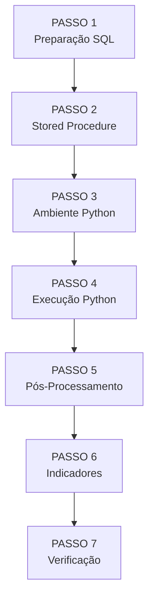

# Guia de Execução Passo a Passo

Este guia detalha o processo completo para executar o Sistema Sentinela, desde a configuração até a geração dos resultados.

---

## 1. Visão Geral



---

## 2. PASSO 1: Preparação do Banco de Dados

### 2.1. Conectar ao Banco

1. Abra o **SQL Server Management Studio (SSMS)**
2. Conecte-se à instância do SQL Server (ex: `SDH-DIE-BD`)
3. Defina o contexto para a base de trabalho:

```sql
USE [temp_CGUSC];
```

### 2.2. Abrir Script de Preparação

Abra o arquivo:

```
📄 01 - preparacao_dados.sql
```

### 2.3. Executar

1. Pressione **F5** ou clique em "Execute"
2. Aguarde a conclusão (pode levar algumas horas)

### 2.4. Verificar

Após a conclusão, verifique se as tabelas foram criadas:

```sql
-- Verificar quantidade de CNPJs
SELECT COUNT(*) AS total_cnpjs FROM temp_CGUSC.dbo.lista_cnpjs;

-- Verificar estoque inicial
SELECT COUNT(*) AS total_estoques FROM temp_CGUSC.dbo.estoque_inicialFP;

-- Verificar particionamento
SELECT classif, COUNT(*) AS qtd
FROM temp_CGUSC.dbo.classif
GROUP BY classif
ORDER BY classif;
```

!!! success "Resultado Esperado" - `lista_cnpjs`: ~34.000 registros - `estoque_inicialFP`: Varia (milhões) - `classif`: 100 lotes balanceados

---

## 3. PASSO 2: Criar Stored Procedure

### 3.1. Abrir Script

Abra o arquivo:

```
📄 03 - procPreparaDados.sql
```

### 3.2. Executar

1. Execute o script inteiro
2. Este script **não insere dados** - apenas cria o objeto reutilizável

### 3.3. Verificar

Confirme a criação no Pesquisador de Objetos:

```
temp_CGUSC > Programmability > Stored Procedures > dbo.procPreparaDados
```

---

## 4. PASSO 3: Configurar Ambiente Python

### 4.1. Criar Ambiente Virtual

```powershell
# Navegue até a pasta do projeto
cd "C:\caminho\para\projeto\sentinela"

# Crie o ambiente virtual
python -m venv venv

# Ative o ambiente
.\venv\Scripts\activate
```

### 4.2. Instalar Dependências

```powershell
pip install -r requirements.txt
```

Se não tiver o `requirements.txt`, instale manualmente:

```powershell
pip install pyodbc==5.1.0 pandas==2.2.2 XlsxWriter==3.2.0 tqdm==4.66.4 art==6.1
```

### 4.3. Verificar Instalação

```powershell
pip list
```

Deve mostrar todas as bibliotecas instaladas.

---

## 5. PASSO 4: Executar Análise Python

### 5.1. Abrir Script

Abra o arquivo:

```
📄 sentinelav8.py
```

### 5.2. Ajustar Parâmetros

!!! danger "Obrigatório"
Ajuste as datas para corresponder às definidas no SQL:

```python
# Linhas 46-47 (aproximadamente)
DATA_INICIAL_ANALISE = '2015-07-01'
DATA_FINAL_ANALISE = datetime.strptime('2024-12-10', '%Y-%m-%d').date()
```

### 5.3. Executar

=== "Via Terminal"

    ```powershell
    python sentinelav8.py
    ```

=== "Via IDE"

    1. Abra o script na IDE
    2. Configure o interpretador para usar o `venv`
    3. Execute (F5 ou botão Run)

### 5.4. Acompanhar Progresso

O terminal exibirá duas barras de progresso:

```
Progresso Geral: |████████░░░░░░░░░░░░| 40/100 [4:23:15<6:34:22]
Bloco 40:        |██████████████░░░░░░| 280/350 [00:45:12<00:11:23]
```

- **Barra superior:** Progresso dos 100 lotes
- **Barra inferior:** Progresso dentro do lote atual

### 5.5. Tempo Estimado

!!! warning "Longa Execução"
O processamento de cada CNPJ leva **15 segundos**.


---

## 6. PASSO 5: Pós-Processamento

Após a conclusão do Python, execute o pós-processamento para consolidar os resultados.

### 6.1. Abrir Script

```
📄 05 - pos_processamento.sql
```

### 6.2. Executar

1. Retorne ao SSMS
2. Execute o script inteiro

### 6.3. Verificar

```sql
-- Verificar tabela consolidada
SELECT TOP 100 *
FROM temp_CGUSC.dbo.resultado_Sentinela_2015_2024
ORDER BY valor_sem_comprovacao DESC;
```

---

## 7. PASSO 6: Calcular Indicadores

Execute os scripts de indicadores na pasta `Indicadores/`:

### 7.1. Ordem de Execução (Sugerida)

1. Scripts de cálculo individual (em qualquer ordem):

   - `falecidos.sql`
   - `inconsistencia_clinica.sql`
   - `teto.sql`
   - ... (demais indicadores)

2. Por último, execute:
   - `matriz_risco_final.sql`

### 7.2. Verificar

```sql
-- Verificar matriz de risco
SELECT TOP 100 *, CLASSIFICACAO_RISCO
FROM temp_CGUSC.dbo.Matriz_Risco_Final
ORDER BY SCORE_RISCO_FINAL DESC;
```

---

## 8. PASSO 7: Verificação Final

### 8.1. Checklist de Validação

- [ ] Todos os CNPJs processados (status != 2 RUNNING)
- [ ] Tabela `resultado_Sentinela` populada
- [ ] Matriz de Risco com classificações
- [ ] Rankings calculados
- [ ] Relatórios Excel gerados

### 8.2. Consultas de Verificação

```sql
-- Status dos processamentos
SELECT situacao, COUNT(*) as qtd
FROM temp_CGUSC.dbo.processamentosFP
GROUP BY situacao;

-- Distribuição de risco
SELECT CLASSIFICACAO_RISCO, COUNT(*) as qtd
FROM temp_CGUSC.dbo.Matriz_Risco_Final
GROUP BY CLASSIFICACAO_RISCO
ORDER BY qtd DESC;

-- Top 10 irregulares
SELECT TOP 10 cnpj, razaoSocial, valor_sem_comprovacao
FROM temp_CGUSC.dbo.resultado_Sentinela_2015_2024
ORDER BY valor_sem_comprovacao DESC;
```

---

## 9. Retomada de Execução

### 9.1. Se o Python Parar

O sistema possui mecanismo de retomada automática:

1. Os CNPJs já processados (status SUCCESS) são **pulados**
2. O último CNPJ incompleto (status RUNNING) é **limpo e reprocessado**
3. Basta executar `sentinelav8.py` novamente

### 9.2. Se o SQL Falhar

Se o script SQL falhar:

1. Identifique o ponto de falha no log de erros
2. Execute apenas as etapas pendentes
3. Alguns scripts podem ser re-executados sem problemas (são idempotentes)

---

## 10. Geração de Relatórios Sob Demanda

Para gerar relatório de um CNPJ específico após o processamento:

```powershell
python gerar_relatorio_memoriav8.py 12345678000199 1
```

Onde:

- `12345678000199` = CNPJ a gerar
- `1` = Tipo (1=Completo, 2=Resumido)

---
