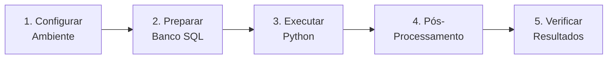

# Execução do Sistema

Esta seção contém as instruções para configurar o ambiente e executar o Sistema Sentinela.

---

## Navegação

- :material-list-status:{ .lg .middle } **Pré-requisitos**

  ***

  Software e dados necessários para executar o sistema.

  [:octicons-arrow-right-24: Ver pré-requisitos](pre-requisitos.md)

- :material-play-circle:{ .lg .middle } **Guia de Execução**

  ***

  Instruções passo a passo para executar cada fase.

  [:octicons-arrow-right-24: Ver guia](guia-execucao.md)

---

## Visão Geral do Processo

---

## Tempo Estimado

| Fase                     | Tempo Estimado | Observação             |
| ------------------------ | -------------- | ---------------------- |
| Configuração do ambiente | 30 min         | Uma única vez          |
| Fase 1 (SQL)             | 2-4 horas      | Depende do volume      |
| Fase 2 (Python)          | Vários dias    | ~34.000 CNPJs          |
| Fase 4 (SQL)             | 1-2 horas      | Após Python terminar   |
| Verificação              | 30 min         | Consultas de validação |

---

## Próximos Passos

1. Verifique os [Pré-requisitos](pre-requisitos.md)
2. Siga o [Guia de Execução](guia-execucao.md)
