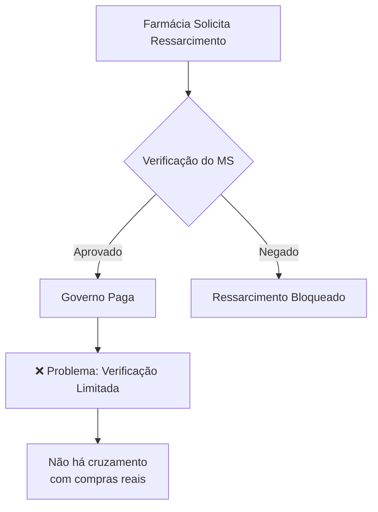
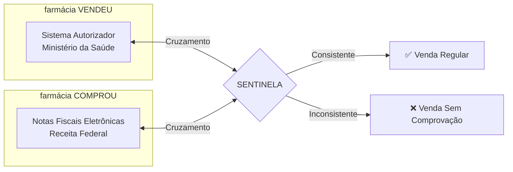

# 📖 Contexto e Objetivos

## ℹ️ 1. O Programa Farmácia Popular do Brasil

### 1.1. Descrição do Programa

O **Programa Farmácia Popular do Brasil (PFPB)**, instituído pela Lei nº 10.858/2004, é uma das maiores políticas públicas de acesso a medicamentos do país. O programa visa ampliar o acesso da população a medicamentos essenciais, oferecendo-os a preços subsidiados ou gratuitamente.

### 1.2. Modalidade "Aqui Tem Farmácia Popular"

O Projeto Sentinela foca na modalidade **"Aqui Tem Farmácia Popular"**, onde:

- O governo federal firma convênio com **farmácias privadas** em todo o território nacional
- Os estabelecimentos vendem medicamentos a preços subsidiados ou gratuitos
- O governo **ressarce** as farmácias pelo valor do subsídio concedido
- O ressarcimento é feito com base nos registros do **Sistema Autorizador de Vendas**

### 1.3. Patologias Cobertas

O programa cobre medicamentos para tratamento das seguintes condições crônicas:

| Patologia       | Medicamentos Incluídos                      |
| --------------- | ------------------------------------------- |
| **Hipertensão** | Anti-hipertensivos diversos                 |
| **Diabetes**    | Insulinas e antidiabéticos orais            |
| **Asma**        | Broncodilatadores e corticoides inalatórios |
| **Rinite**      | Corticoides nasais                          |
| **Parkinson**   | Levodopa, pramipexol, entacapona            |
| **Osteoporose** | Alendronato, risedronato                    |
| **Glaucoma**    | Colírios específicos                        |

### 1.4. Números do Programa

!!! info "Dimensão do Programa" - **34.000+** farmácias credenciadas em todo o Brasil - **Bilhões de reais** em ressarcimentos anuais - **Milhões** de beneficiários atendidos - Cobertura em **todos os municípios** brasileiros

---

## 🚫 2. O Problema Identificado

### 2.1. Vulnerabilidades do Sistema

O modelo de ressarcimento do PFPB apresenta vulnerabilidades que podem ser exploradas por estabelecimentos mal-intencionados:

### 2.2. Tipos de Irregularidades Detectadas

A análise preliminar dos dados identificou padrões recorrentes de irregularidades:

#### 2.2.1. Vendas sem Lastro em Estoque

A irregularidade mais comum ocorre quando uma farmácia **registra mais vendas do que medicamentos adquiriu**:

!!! danger "Exemplo de Irregularidade"
**Situação:** Farmácia comprou 100 caixas de medicamento X no período.

    **Problema:** Registrou a venda de 500 caixas no mesmo período.

    **Resultado:** 400 caixas vendidas SEM COMPROVAÇÃO de aquisição.

#### 2.2.2. Padrões Atípicos de Prescrição

- Concentração excessiva de vendas em **poucos médicos prescritores**
- Médicos com volume de prescrições **fora do comum** (>30/dia)
- Uso de **CRMs inexistentes ou cancelados**
- Prescrições emitidas **antes da data de registro** do médico no CFM

#### 2.2.3. Anomalias Cadastrais

- Vendas para **beneficiários já falecidos**
- Dispensações **incompatíveis com o perfil clínico** do paciente
- Pacientes de **outras unidades da federação** sem justificativa

#### 2.2.4. Padrões Operacionais Suspeitos

- Vendas **consecutivas em menos de 60 segundos** (indicativo de automação)
- Concentração de vendas na **madrugada** (00h-06h)
- **Ticket médio** muito acima da média do mercado
- Dispensação sempre no **teto máximo permitido**

---

## 🎯 3. A Premissa Fundamental

### 3.1. O Princípio Central

!!! quote "Premissa da Auditoria"
**"Um estabelecimento não pode vender aquilo que não comprou."**

    Esta premissa simples, porém poderosa, fundamenta toda a lógica de auditoria do Sistema Sentinela.

### 3.2. Base Legal e Documental

A verificação se sustenta em duas bases de dados oficiais:

### 3.3. Por que essa abordagem funciona?

A metodologia é **sólida** porque:

1. **Dados oficiais:** Utiliza bases governamentais
2. **Rastreabilidade:** Cada venda é vinculada a notas fiscais específicas
3. **Objetividade:** O cálculo é matemático, não subjetivo
4. **Auditabilidade:** Todas as etapas são documentadas e reproduzíveis

---

## 🚀 4. Objetivos do Projeto

### 4.1. Objetivo Geral

!!! success "Objetivo Principal"
Desenvolver e operacionalizar um **sistema automatizado de auditoria** capaz de identificar, quantificar e documentar irregularidades nas dispensações do Programa Farmácia Popular do Brasil.

### 4.2. Objetivos Específicos

#### 4.2.1. Análise de Fluxo de Estoque

- Construir **simulação de fluxo de estoque** para cada farmácia credenciada
- Processar todas as transações de entrada (compras) e saída (vendas)
- Identificar **períodos de saldo negativo** (vendas sem lastro)
- Quantificar o **valor financeiro** das irregularidades

#### 4.2.2. Matriz de Risco

- Desenvolver **17 indicadores independentes** de risco e fraude
- Calcular **Risco Relativo** comparando cada farmácia com a média do mercado
- Gerar **classificação de risco** (Crítico, Alto, Médio, Baixo, Mínimo)
- Criar **rankings** nacional, estadual e municipal

#### 4.2.3. Análise de Prescritores

- Identificar **padrões anômalos** de prescrição médica
- Validar **regularidade dos CRMs** junto ao Conselho Federal de Medicina
- Detectar **concentração** em poucos prescritores
- Flagrar médicos com comportamento de **"robô"** (volume impossível)

#### 4.2.4. Relatórios e Documentação

- Gerar **dossiês individualizados** para cada farmácia
- Incluir **memória de cálculo completa** (rastreabilidade)
- Disponibilizar **versão resumida** para triagem rápida
- Alimentar **painel gerencial** para priorização de casos

---

## ⚖️ 5. Justificativa

### 5.1. Impacto Financeiro

O Programa Farmácia Popular movimenta **bilhões de reais** anualmente. Mesmo pequenos percentuais de irregularidade representam:

- Prejuízo significativo aos **cofres públicos**
- Recursos desviados que poderiam atender mais **beneficiários legítimos**
- Enriquecimento ilícito de **estabelecimentos fraudulentos**

### 5.2. Impossibilidade de Auditoria Manual

Com mais de **34.000 farmácias** e **milhões de transações** por mês, é **impossível** realizar auditoria individual de forma manual. O sistema automatizado permite:

- Processar **100% das farmácias** credenciadas
- Analisar **todo o período** histórico disponível
- Aplicar **critérios uniformes** de análise
- Identificar irregularidades em **escala nacional**

### 5.3. Suporte a Ações de Controle

Os resultados do Sentinela subsidiam diversas ações:

| Ação                   | Órgão    | Tipo de Uso                       |
| ---------------------- | -------- | --------------------------------- |
| Auditorias presenciais | CGU      | Seleção de alvos prioritários     |
| Descredenciamento      | MS/SCTIE | Farmácias de alto risco           |
| Investigações          | PF/MPF   | Provas técnicas de irregularidade |
| Recuperação de valores | AGU      | Cálculo de dano ao erário         |

---

## 🌟 6. Benefícios Esperados

### 6.1. Para o Controle

- ✅ **Aumento da cobertura** de fiscalização
- ✅ **Redução de custos** de auditoria
- ✅ **Priorização** de casos de maior risco
- ✅ **Padronização** de critérios de análise

### 6.2. Para o Programa

- ✅ **Inibição de fraudes** pelo efeito dissuasório
- ✅ **Saneamento** do rol de credenciados
- ✅ **Melhoria da qualidade** dos dados
- ✅ **Economia de recursos** públicos

### 6.3. Para os Beneficiários

- ✅ **Garantia de acesso** a medicamentos reais
- ✅ **Segurança** nas dispensações
- ✅ **Confiança** no programa

---

