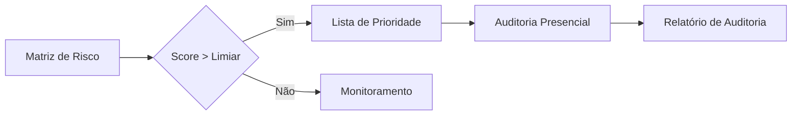

# Resultados Alcançados

## 1. Visão Geral dos Resultados

O Projeto Sentinela foi executado em duas rodadas principais, cobrindo o período de julho de 2015 a dezembro de 2024.

!!! success "Impacto do Projeto"
O sistema processou **mais de 34.000 farmácias** e identificou irregularidades significativas que representam **bilhões de reais** em vendas sem comprovação de lastro em estoque.

---

## 2. Rodada 1: 2015-2020

### 2.1. Escopo da Análise

| Aspecto                     | Informação                       |
| --------------------------- | -------------------------------- |
| **Período Analisado**       | Julho/2015 a Dezembro/2020       |
| **Farmácias Processadas**   | ~34.000 estabelecimentos         |
| **Ano de Execução**         | 2020                             |
| **Medicamentos Analisados** | Todos os GTINs elegíveis ao PFPB |

### 2.2. Produtos Gerados

- ✅ Relatórios individualizados para cada farmácia com irregularidades
- ✅ Tabela consolidada de resultados (`resultado_Sentinela_2015_2020`)
- ✅ Ranking de farmácias por valor de irregularidade
- ✅ Base de dados para alimentação do painel gerencial

### 2.3. Disponibilidade

Os resultados da primeira rodada estão disponíveis na pasta compartilhada:

```
📁 Resultados 2015-2020/
├── 📊 Relatórios Completos/
├── 📊 Relatórios Resumidos/
├── 📈 Análise Consolidada/
└── 📋 Tabelas de Resultado/
```

---

## 3. Rodada 2: 2015-2024

### 3.1. Escopo da Análise

| Aspecto                   | Informação                        |
| ------------------------- | --------------------------------- |
| **Período Analisado**     | Janeiro/2015 a Dezembro/2024      |
| **Farmácias Processadas** | ~34.000 estabelecimentos          |
| **Ano de Execução**       | 2015-2024                         |
| **Novidades**             | Matriz de Risco + Análise de CRMs |

### 3.2. Evolução do Sistema

A segunda rodada incorporou melhorias significativas:

=== "Matriz de Risco"

    - **17 indicadores** independentes de fraude
    - Cálculo de **Risco Relativo** (comparação com média UF/BR)
    - **Classificação automática** de risco (Crítico a Mínimo)
    - **Rankings** nacional, estadual e municipal

=== "Análise de CRMs"

    - Validação de **regularidade dos CRMs** no CFM
    - Detecção de **médicos-robô** (>30 prescrições/dia)
    - Análise de **concentração** de prescritores
    - Alertas de **distância geográfica** (>400km)

=== "Relatórios Aprimorados"

    - Nova aba de **Evolução Financeira** com gráficos
    - Nova aba de **Indicadores de Risco** comparativos
    - Nova aba de **Análise de CRMs** detalhada
    - **Memória de cálculo comprimida** para otimização

### 3.3. Produtos Gerados

- ✅ Relatórios individualizados com 4 abas completas
- ✅ Tabela consolidada com indicadores (`resultado_Sentinela_2021_2024`)
- ✅ Matriz de Risco Final (`Matriz_Risco_Final`)
- ✅ Análise de prescritores (`indicadorCRM_Completo`)
- ✅ Rankings em múltiplos níveis (BR, UF, Município)

### 3.4. Disponibilidade

Os resultados da segunda rodada estão disponíveis na pasta compartilhada:

```
📁 Resultados 2015-2024/
├── 📊 Relatórios Completos/
├── 📊 Relatórios Resumidos/
├── 📈 Matriz de Risco/
├── 👨‍⚕️ Análise de CRMs/
└── 📋 Tabelas de Resultado/
```

---

## 4. Métricas de Processamento

### 4.1. Performance do Sistema

O sistema registra métricas detalhadas de performance para cada CNPJ processado:

| Métrica                        | Descrição                                |
| ------------------------------ | ---------------------------------------- |
| `tempo_processamento_segundos` | Tempo total de processamento do CNPJ     |
| `total_registros_processados`  | Quantidade de transações analisadas      |
| `total_medicamentos`           | Quantidade de GTINs distintos            |
| `situacao`                     | Status final (sucesso, falha, sem dados) |

### 4.2. Estatísticas de Status

A tabela `processamentosFP` mantém o status de cada farmácia:

| Código | Status          | Significado                               |
| ------ | --------------- | ----------------------------------------- |
| 1      | `SIT_SUCCESS`   | Processado com irregularidades detectadas |
| 2      | `SIT_RUNNING`   | Processamento em andamento                |
| 3      | `SIT_FAILED`    | Falha durante execução                    |
| 4      | `SIT_NO_DATA`   | Sem dados para o período                  |
| 5      | `SIT_NO_SALES`  | Sem vendas no período                     |
| 6      | `SIT_NO_ISSUES` | Processado sem irregularidades            |

---

## 5. Utilização dos Resultados

### 5.1. Painel Gerencial

Os resultados alimentam o **Painel Sentinela**, disponível em:

🔗 [https://paineis.cgu.gov.br/sentinela](https://paineis.cgu.gov.br/sentinela)

O painel permite:

- Visualização de rankings por UF e município
- Filtros por indicadores de risco
- Detalhamento de farmácias específicas
- Exportação de dados para análise

### 5.2. Seleção de Alvos para Auditoria

Os resultados são utilizados para priorizar auditorias presenciais:



---

## 6. Próximas Etapas

### 6.1. Manutenção e Atualizações

- Atualização periódica das bases de dados
- Refinamento dos indicadores de risco
- Inclusão de novos alertas conforme padrões emergentes
- Documentação contínua de metodologias

---

!!! info "Acesso aos Resultados"
Para acesso aos resultados detalhados, entre em contato com a equipe do NEP/SC através dos [canais oficiais](../contatos.md).
