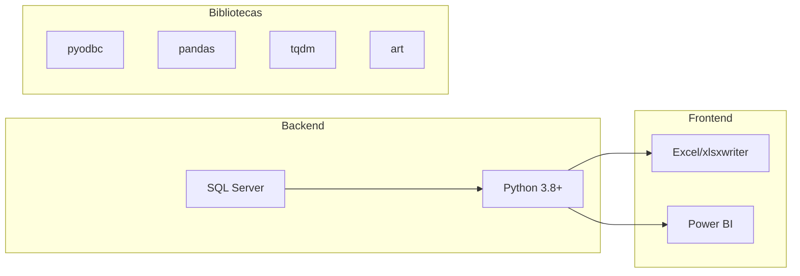

# Resumo do Projeto

## 1. Informações Gerais

| Campo                 | Informação                                               |
| --------------------- | -------------------------------------------------------- |
| **Nome do Projeto**   | Sentinela                                                |
| **Órgão Responsável** | Controladoria-Geral da União (CGU)                       |
| **Unidade Executora** | Núcleo de Estudos e Pesquisas (NEP) - CGU Santa Catarina |
| **Data de Início**    | 31 de março de 2020                                      |
| **Status**            | Projeto em Andamento                                     |
| **Pasta de Trabalho** | 001 - Farmácia_Popular                                   |
| **Versão Atual**      | 8.0 (sentinelav8.py)                                     |

---

## 2. Equipe Responsável

### Desenvolvedores Principais

| Nome                           | E-mail                          | Função                    |
| ------------------------------ | ------------------------------- | ------------------------- |
| Guilherme Martins Willemann    | guilherme.willemann@cgu.gov.br  | Análise e desenvolvimento |
| Tatiana Popia Corrêa           | tatiana.correa@cgu.gov.br       | Análise e desenvolvimento |
| Fernando Rodrigues João Junior | fernando.joao-junior@cgu.gov.br | Análise                   |

### Chefias Envolvidas

| Nome                 | Cargo        | E-mail                    |
| -------------------- | ------------ | ------------------------- |
| Tatiana Popia Corrêa | Chefe do NEP | tatiana.correa@cgu.gov.br |

---

## 3. Produtos Resultantes

O projeto gera os seguintes produtos para cada farmácia analisada:

### 3.1. Relatórios Individualizados

Cada farmácia credenciada recebe dois tipos de relatório em formato Excel (.xlsx):

=== "Relatório Completo"

    Contém **todo o histórico transacional** da farmácia no período analisado:

    - Todas as movimentações de entrada (compras) e saída (vendas)
    - Fluxo cronológico de estoque para cada medicamento (GTIN)
    - Indicadores de risco comparados com médias estaduais e nacionais
    - Análise detalhada dos prescritores (CRMs)

    **Uso:** Auditorias fiscais completas e investigações profundas.

=== "Relatório Resumido"

    Contém **apenas as irregularidades detectadas**:

    - Períodos onde houve vendas sem comprovação de estoque
    - Medicamentos com saldo negativo no fluxo de estoque
    - Indicadores de risco com desvios significativos
    - Prescritores com alertas ativos

    **Uso:** Triagem rápida e priorização de casos.

### 3.2. Estrutura do Dossiê Excel

Cada relatório é composto por 4 abas:

| Aba                     | Conteúdo                              | Finalidade                          |
| ----------------------- | ------------------------------------- | ----------------------------------- |
| **Movimentação**        | Fluxo cronológico de estoque por GTIN | Prova documental da irregularidade  |
| **Evolução Financeira** | Gráficos semestrais de valores        | Identificar quando a fraude começou |
| **Indicadores**         | 17 métricas de risco comparativas     | Contextualizar o comportamento      |
| **Análise de CRMs**     | Detalhamento dos prescritores         | Investigar a "ponta da caneta"      |

---

## 4. Rodadas de Análise

O projeto foi executado em duas rodadas principais:

### Rodada 1: 2015-2020

| Aspecto                  | Informação                                  |
| ------------------------ | ------------------------------------------- |
| **Período**              | Julho/2015 a Dezembro/2020                  |
| **Farmácias Analisadas** | ~34.000 estabelecimentos                    |
| **Ano de Execução**      | 2020                                        |
| **Status**               | ✅ Concluída                                |
| **Resultados**           | Disponíveis na pasta "Resultados 2015-2020" |

### Rodada 2: 2021-2024

| Aspecto                  | Informação                                  |
| ------------------------ | ------------------------------------------- |
| **Período**              | Janeiro/2021 a Dezembro/2024                |
| **Farmácias Analisadas** | ~34.000 estabelecimentos                    |
| **Ano de Execução**      | 2015-2024                                   |
| **Status**               | ✅ Concluída                                |
| **Resultados**           | Disponíveis na pasta "Resultados 2015-2024" |

---

## 5. Bases de Dados Utilizadas

O sistema integra múltiplas bases de dados governamentais:

| Base de Dados           | Fonte               | Conteúdo Principal                                     |
| ----------------------- | ------------------- | ------------------------------------------------------ |
| `db_farmaciapopular`    | Ministério da Saúde | Registros de dispensações (vendas) do PFPB             |
| `db_farmaciapopular_nf` | Receita Federal     | Notas Fiscais Eletrônicas de aquisição de medicamentos |
| `db_CNPJ`               | Receita Federal     | Cadastro Nacional de Pessoas Jurídicas                 |
| `db_CPF`                | Receita Federal     | Cadastro de Pessoas Físicas                            |
| `db_Cadunico`           | MDS                 | Cadastro Único para Programas Sociais                  |
| `temp_CGUSC`            | CGU/SC              | Base de trabalho e resultados da auditoria             |

---

## 6. Tecnologias Utilizadas

### Stack de Desenvolvimento

### Detalhamento

| Camada                   | Tecnologia           | Versão | Função                                      |
| ------------------------ | -------------------- | ------ | ------------------------------------------- |
| **Banco de Dados**       | Microsoft SQL Server | 2019+  | Armazenamento e preparação de dados         |
| **Processamento**        | Python               | 3.8+   | Lógica de auditoria e geração de relatórios |
| **Conexão**              | pyodbc               | 5.1.0  | Driver ODBC para SQL Server                 |
| **Manipulação de Dados** | pandas               | 2.2.2  | DataFrames e análise                        |
| **Geração de Excel**     | XlsxWriter           | 3.2.0  | Criação de planilhas formatadas             |
| **Interface**            | tqdm                 | 4.66.4 | Barras de progresso no terminal             |
| **Visual**               | art                  | 6.1    | Arte ASCII no cabeçalho                     |
| **Visualização**         | Power BI             | -      | Painel gerencial online                     |

---

## 7. Arquivos do Projeto

### Scripts Python Principais

| Arquivo                        | Linhas | Descrição                                                        |
| ------------------------------ | ------ | ---------------------------------------------------------------- |
| `sentinelav8.py`               | ~858   | Motor principal de processamento - Simulação de fluxo de estoque |
| `gerar_relatorio_memoriav8.py` | ~1571  | Gerador de relatórios Excel completos                            |

### Scripts SQL

| Pasta          | Arquivos    | Descrição                                                |
| -------------- | ----------- | -------------------------------------------------------- |
| `/`            | 01 a 06     | Scripts de preparação, processamento e análise gerencial |
| `Indicadores/` | 22 arquivos | Scripts para cálculo de cada indicador de risco          |

### Scripts SQL da Pasta Indicadores

| Arquivo                                 | Indicador                                 |
| --------------------------------------- | ----------------------------------------- |
| `falecidos.sql`                         | Vendas para beneficiários falecidos       |
| `inconsistencia_clinica.sql`            | Incompatibilidade patológica (idade/sexo) |
| `teto.sql`                              | Dispensação em teto máximo                |
| `polimedicamento.sql`                   | Cupons com 4+ itens                       |
| `media_itens.sql`                       | Média de itens por autorização            |
| `tickermedio.sql`                       | Valor do ticket médio                     |
| `receita_por_paciente.sql`              | Faturamento por cliente                   |
| `venda_per_capita.sql`                  | Venda per capita municipal                |
| `medicamentos_alto_custo.sql`           | Concentração em medicamentos caros        |
| `vendas_consecutivas.sql`               | Vendas rápidas (<60 segundos)             |
| `horario_atipico.sql`                   | Vendas na madrugada                       |
| `concentracao_dias_pico.sql`            | Concentração em dias de pico              |
| `geografico.sql`                        | Dispersão geográfica                      |
| `pacientes_unicos.sql`                  | Pacientes com compra única                |
| `crms.sql`                              | Concentração de prescritores (HHI)        |
| `exclusividade_crm.sql`                 | CRMs exclusivos da farmácia               |
| `crms_irregulares.sql`                  | CRMs inválidos ou retroativos             |
| `matriz_risco_final.sql`                | Consolidação do score de risco            |
| `gerador_dados_para_indicador_crms.sql` | Preparação de dados de CRMs               |

---

## 8. Links Oficiais

| Recurso                  | URL                                                                          |
| ------------------------ | ---------------------------------------------------------------------------- |
| **Painel Sentinela**     | [https://paineis.cgu.gov.br/sentinela](https://paineis.cgu.gov.br/sentinela) |
| **Resultados 2015-2020** | [Pasta compartilhada interna]                                                |
| **Resultados 2015-2024** | [Pasta compartilhada interna]                                                |

---

!!! info "Sobre esta documentação"
Esta documentação reflete a versão 8.0 do sistema Sentinela, que inclui a Matriz de Risco completa com 17 indicadores e o módulo de análise de prescritores (CRMs).
