# 🛡️ Projeto Sentinela

- :material-shield-check:{ .lg .middle } **Sistema de Auditoria Automatizada**

  ***

  O **Projeto Sentinela** é uma solução desenvolvida pela Controladoria-Geral da União (CGU) para detectar irregularidades no Programa Farmácia Popular do Brasil (PFPB).

  [:octicons-arrow-right-24: Conhecer o projeto](guia/resumo.md)

- :material-chart-box:{ .lg .middle } **17 Indicadores de Fraude**

  ***

  Matriz de risco com indicadores estatísticos que permitem identificar padrões anômalos de comportamento e priorizar auditorias.

  [:octicons-arrow-right-24: Ver indicadores](indicadores/index.md)

- :material-file-document:{ .lg .middle } **Relatórios Automatizados**

  ***

  Dossiês individualizados para cada farmácia com movimentação de estoque, evolução financeira e análise de prescritores.

  [:octicons-arrow-right-24: Explorar relatórios](relatorios/index.md)

- :material-cog:{ .lg .middle } **Guia de Execução**

  ***

  Instruções detalhadas para configuração do ambiente, execução dos scripts e geração de resultados.

  [:octicons-arrow-right-24: Começar agora](execucao/index.md)

---

## 📊 Números do Projeto

| Métrica                  | Valor                      |
| ------------------------ | -------------------------- |
| **Período Analisado**    | Julho/2015 a Dezembro/2024 |
| **Farmácias Auditadas**  | 34.000+ estabelecimentos   |
| **Indicadores de Risco** | 17 métricas independentes  |
| **Rodadas de Análise**   | 2 (2015-2020 e 2021-2024)  |

---

## 🎯 Premissa Fundamental

!!! quote "Princípio Central da Auditoria"
**"Um estabelecimento não pode vender aquilo que não comprou."**

    Essa premissa simples, porém poderosa, permite identificar fraudes contra o erário de forma objetiva e rastreável, comparando os registros de vendas (Sistema Autorizador do Ministério da Saúde) com as aquisições documentadas (Notas Fiscais Eletrônicas da Receita Federal).

---

## 🏗️ Arquitetura do Sistema

```mermaid
flowchart LR
    subgraph Entrada["📥 Fontes de Dados"]
        A[(db_farmaciapopular<br/>Vendas)]
        B[(db_farmaciapopular_nf<br/>NF-e Aquisições)]
        C[(db_CNPJ<br/>Cadastros)]
    end

    subgraph Processamento["⚙️ Processamento"]
        D[Fase 1<br/>Preparação SQL]
        E[Fase 2<br/>Análise Python]
        F[Fase 3<br/>Relatórios]
    end

    subgraph Saida["📤 Produtos"]
        G[📊 Matriz de Risco]
        H[📑 Dossiês Excel]
        I[📈 Painel BI]
    end

    A --> D
    B --> D
    C --> D
    D --> E
    E --> F
    F --> G
    F --> H
    F --> I
```

---

## 📚 Como Usar Esta Documentação

=== "Para Auditores"

    Se você é auditor e precisa entender os resultados:

    1. Comece pelo [Resumo do Projeto](guia/resumo.md)
    2. Entenda os [Indicadores de Risco](indicadores/index.md)
    3. Aprenda a interpretar os [Relatórios](relatorios/index.md)

=== "Para Desenvolvedores"

    Se você precisa executar ou modificar o sistema:

    1. Revise a [Arquitetura](arquitetura/index.md)
    2. Entenda o [Fluxo de Dados](arquitetura/fluxo-dados.md)
    3. Siga o [Guia de Execução](execucao/guia-execucao.md)

=== "Para Gestores"

    Se você precisa de uma visão executiva:

    1. Leia o [Contexto e Objetivos](guia/contexto.md)
    2. Veja os [Resultados Alcançados](guia/resultados.md)
    3. Conheça a [Matriz de Risco](indicadores/matriz-risco.md)

---

## 🔗 Acesso Rápido

- :material-web: [Painel Sentinela](https://paineis.cgu.gov.br/sentinela) - Visualização online dos resultados
- :material-folder: Resultados 2015-2020 - Primeira rodada de análise
- :material-folder: Resultados 2021-2024 - Segunda rodada de análise
- :material-email: [Contatos da Equipe](contatos.md) - Suporte técnico

---
