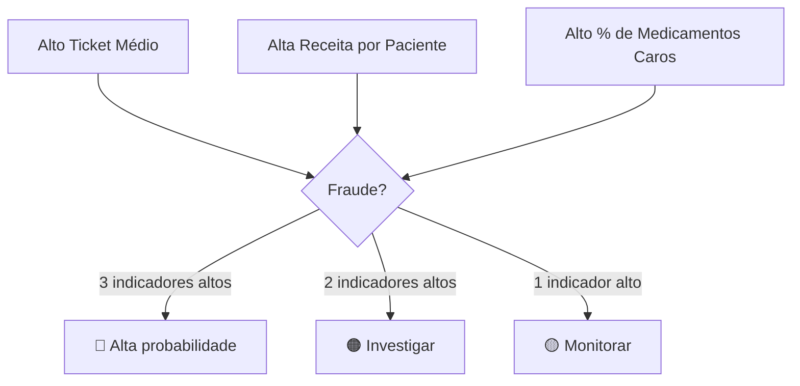

# Grupo 3: Indicadores de Padrões Financeiros

Este grupo contém indicadores que analisam os **padrões financeiros** das vendas, incluindo valores médios, faturamento per capita e concentração em medicamentos de alto custo.

---

## 1. Ticket Médio

### 1.1. Definição

Calcula o **valor médio** de cada transação (autorização/cupom fiscal).

### 1.2. Script

```
📄 Indicadores/tickermedio.sql
```

### 1.3. Lógica de Cálculo

#### Algoritmo

1. **Soma:** Agrega o valor total de todas as vendas
2. **Contagem:** Conta o número de autorizações únicas
3. **Divisão:** Calcula a média

### 1.4. Fórmula

$$
\text{Ticket Médio} = \frac{\sum \text{Valor Autorizado}}{\text{COUNT(DISTINCT nu\_autorizacao)}}
$$

### 1.5. Interpretação

O ticket médio varia significativamente por região e tipo de clientela. A análise deve ser feita **comparativamente**:

| Situação             | Interpretação       |
| -------------------- | ------------------- |
| Ticket ≈ Média UF    | Normal              |
| Ticket > 2x Média UF | Elevado - verificar |

### 1.6. Fatores que Influenciam

| Fator                                | Efeito no Ticket            |
| ------------------------------------ | --------------------------- |
| Especialização em medicamentos caros | ⬆️ Aumenta                  |
| Clientela de baixa renda             | ⬇️ Reduz                    |
| Proximidade de unidades de saúde     | ⬇️ Reduz (mais copagamento) |
| Fraude (maximização de valores)      | ⬆️ Aumenta                  |

---

## 2. Receita Média por Paciente

### 2.1. Definição

Calcula o **faturamento médio** por CPF distinto atendido.

### 2.2. Script

```
📄 Indicadores/receita_por_paciente.sql
```

### 2.3. Lógica de Cálculo

#### Algoritmo

1. **Soma:** Agrega o faturamento total
2. **Contagem:** Conta CPFs únicos atendidos
3. **Divisão:** Calcula a média

### 2.4. Fórmula

$$
\text{Receita por Paciente} = \frac{\sum \text{Faturamento Total}}{\text{COUNT(DISTINCT cpf)}}
$$

### 2.5. Interpretação

| Situação                | Possível Causa                                     |
| ----------------------- | -------------------------------------------------- |
| Valor muito baixo       | Muitos pacientes esporádicos                       |
| Valor na média          | Normal                                             |
| Valor muito alto        | Poucos pacientes com muitas compras (concentração) |
| Valor extremamente alto | Possível uso de CPFs fictícios                     |

### 2.6. Análise Combinada

!!! success "Cruzamento Útil"
Combine este indicador com o número de pacientes únicos para uma análise mais completa:

    - **Alta receita + Poucos pacientes:** Concentração suspeita
    - **Alta receita + Muitos pacientes:** Perfil de clientela de alto consumo

---

## 3. Venda Per Capita Municipal

### 3.1. Definição

Calcula o faturamento da farmácia dividido pela **população do município**.

### 3.2. Script

```
📄 Indicadores/venda_per_capita.sql
```

### 3.3. Contexto

Este indicador contextualiza o faturamento em relação ao **tamanho do mercado potencial**. Uma farmácia em uma cidade pequena com faturamento muito alto pode estar atendendo pacientes de outras regiões ou fabricando vendas.

### 3.4. Lógica de Cálculo

#### Fontes de Dados

| Tabela                                    | Uso                     |
| ----------------------------------------- | ----------------------- |
| `movimentacaoFP` ou `resultado_Sentinela` | Faturamento da farmácia |
| `tb_ibge` ou `dadosFarmaciasFP`           | População do município  |

#### Algoritmo

1. **Soma:** Obtém o faturamento total da farmácia
2. **Busca:** Obtém a população do município
3. **Divisão:** Calcula o per capita

### 3.5. Fórmula

$$
\text{Per Capita} = \frac{\text{Faturamento Total da Farmácia}}{\text{População do Município}}
$$

### 3.6. Interpretação

A interpretação deve considerar:

- Número de farmácias no município
- Média estadual do indicador
- Posição geográfica (cidade-polo atrai pacientes de outras cidades)

| Situação                 | Interpretação |
| ------------------------ | ------------- |
| Per capita ≈ Média UF    | Normal        |
| Per capita > 2x Média UF | Elevado       |

---

## 4. Medicamentos de Alto Custo

### 4.1. Definição

Mede a proporção do faturamento proveniente de **medicamentos de alto custo** (percentil 90 de preço).

### 4.2. Script

```
📄 Indicadores/medicamentos_alto_custo.sql
```

### 4.3. Contexto

Medicamentos mais caros oferecem maiores margens para fraude, pois:

- Maximizam o valor de vendas fictícias
- Geram maior ressarcimento com menos transações
- São mais difíceis de auditar individualmente

### 4.4. Lógica de Cálculo

#### Classificação de Alto Custo

Medicamentos são classificados como "alto custo" se seu preço unitário estiver no **percentil 90** ou superior da tabela de medicamentos.

#### Algoritmo

1. **Classificação:** Marca medicamentos de alto custo (`flag_alto_custo = 1`)
2. **Soma:** Agrega valor das vendas de medicamentos de alto custo
3. **Percentual:** Divide pelo faturamento total

### 4.5. Fórmula

$$
\% \text{Alto Custo} = \frac{\sum \text{Vendas de Medicamentos Alto Custo}}{\sum \text{Faturamento Total}} \times 100
$$

### 4.6. Interpretação

| Valor        | Interpretação        |
| ------------ | -------------------- |
| **0% - 40%** | Normal               |
| ** >40% **   | Elevado - investigar |

---

## 5. Resumo do Grupo

| Indicador               | Métrica                  | Unidade | Alerta        |
| ----------------------- | ------------------------ | ------- | ------------- |
| Ticket Médio            | Média de valor por cupom | R$      | > 2x média UF |
| Receita por Paciente    | Faturamento por CPF      | R$      | > 2x média UF |
| Venda Per Capita        | Faturamento / população  | R$      | > 2x média UF |
| Medicamentos Alto Custo | % do faturamento         | %       | > 40%         |

---

## 6. Análise Integrada

### 6.1. Padrão de Maximização Financeira

Quando uma farmácia apresenta valores elevados em **múltiplos indicadores deste grupo**, pode indicar uma estratégia de **maximização de fraude**:



### 6.2. Exemplo

!!! example "Cenário Suspeito"
**Farmácia com:**

    - Ticket médio: R$ 50 (média UF: R$ 20)
    - Receita por paciente: R$ 400 (média UF: R$ 200)
    - % Medicamentos alto custo: 60%

    **Análise:**

    Esta combinação é altamente suspeita. A farmácia parece estar:

    1. Concentrando vendas em medicamentos caros
    2. Maximizando o valor de cada transação
    3. Utilizando poucos CPFs para grandes volumes

---

!!! tip "Próximo Grupo"
Veja o [Grupo 4: Automação & Geografia](grupo4-automacao.md) para indicadores de padrões operacionais e geográficos.
