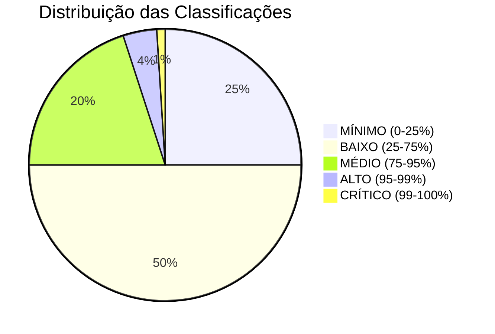
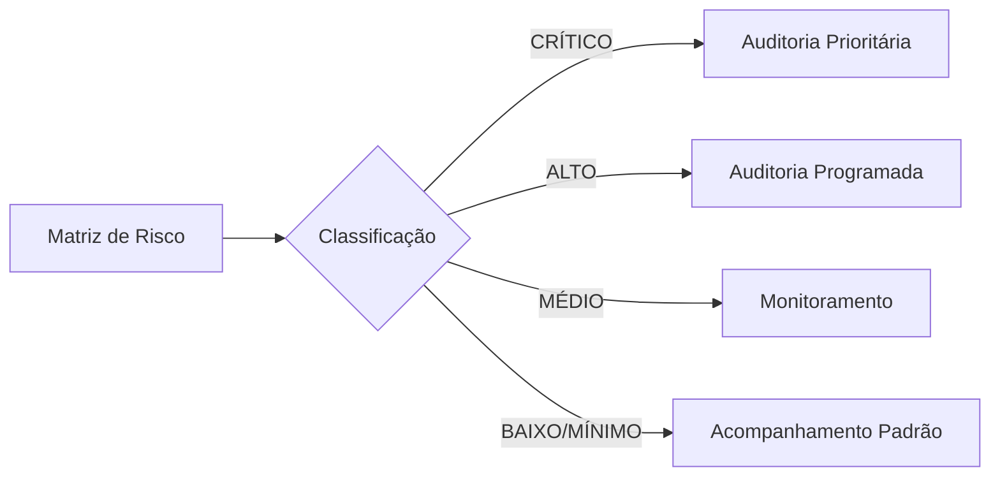

# Matriz de Risco Final

A Matriz de Risco Final é o produto central da análise do Sistema Sentinela. Ela consolida os 17 indicadores individuais em um **score único** e uma **classificação de risco** para cada farmácia.

---

## 1. Conceito

### 1.1. O que é a Matriz de Risco

A Matriz de Risco é uma tabela que contém, para cada farmácia:

- Valores individuais de cada indicador
- Score de risco consolidado
- Classificação de risco (Crítico, Alto, Médio, Baixo, Mínimo)
- Rankings em diferentes níveis (Nacional, Estadual, Municipal)

### 1.2. Script de Geração

```
📄 Indicadores/matriz_risco_final.sql
```

---

## 2. Cálculo do Score de Risco

### 2.1. Metodologia

O Score de Risco Final é calculado em duas etapas:

#### Etapa 1: Normalização (Risco Relativo)

Para cada um dos 17 indicadores, calcula-se o **Risco Relativo (RR)**:

$$
RR_i = \frac{\text{Indicador}_i^{\text{farmácia}}}{\text{Média}_i^{\text{UF}}}
$$

Onde:

- $\text{Indicador}_i^{\text{farmácia}}$ = Valor do indicador $i$ para a farmácia
- $\text{Média}_i^{\text{UF}}$ = Média do indicador $i$ para todas as farmácias da mesma UF

!!! info "Por que usar a média da UF?"
Usar a média estadual como referência permite comparar farmácias em contextos semelhantes, minimizando diferenças regionais de comportamento.

#### Etapa 2: Agregação (Média Aritmética)

O Score Final é a média simples dos 17 Riscos Relativos:

$$
\text{SCORE\_RISCO\_FINAL} = \frac{1}{17} \sum_{i=1}^{17} RR_i
$$

### 2.2. Tratamento de Exceções

| Situação                 | Tratamento                             |
| ------------------------ | -------------------------------------- |
| Média da UF = 0          | Usa média nacional como referência     |
| Média nacional = 0       | Considera RR = 1 (neutro)              |
| Indicador não disponível | Exclui do cálculo (ajusta denominador) |

### 2.3. Interpretação do Score

| Score         | Significado                                    |
| ------------- | ---------------------------------------------- |
| **0.0 - 0.5** | Muito abaixo da média (comportamento exemplar) |
| **0.5 - 1.0** | Abaixo da média (normal)                       |
| **1.0**       | Exatamente na média                            |
| **1.0 - 2.0** | Acima da média (atenção)                       |
| **2.0 - 5.0** | Significativamente acima (alerta)              |
| **> 5.0**     | Muito acima (crítico)                          |

---

## 3. Classificação de Risco

### 3.1. Metodologia (Percentil)

Após calcular o Score para todas as farmácias, aplica-se a função `PERCENT_RANK()` do SQL Server para distribuir os estabelecimentos em faixas.

### 3.2. Faixas de Classificação



| Classificação  | Percentil  | Proporção | Descrição                                 |
| -------------- | ---------- | --------- | ----------------------------------------- |
| 🔴 **CRÍTICO** | 99% - 100% | ~1%       | Top 1% - Maior prioridade                 |
| 🟠 **ALTO**    | 95% - 99%  | ~4%       | Top 5% - Alta prioridade                  |
| 🟡 **MÉDIO**   | 75% - 95%  | ~20%      | Quartil superior - Monitorar              |
| 🟢 **BAIXO**   | 25% - 75%  | ~50%      | Faixa central - Normal                    |
| 🟢 **MÍNIMO**  | 0% - 25%   | ~25%      | Quartil inferior - Comportamento exemplar |

### 3.3. Cores e Alertas Visuais

| Classificação | Cor             | Código Hex |
| ------------- | --------------- | ---------- |
| CRÍTICO       | Vermelho escuro | `#8B0000`  |
| ALTO          | Laranja         | `#FF8C00`  |
| MÉDIO         | Amarelo         | `#FFD700`  |
| BAIXO         | Verde claro     | `#90EE90`  |
| MÍNIMO        | Verde           | `#228B22`  |

---

## 4. Rankings

### 4.1. Tipos de Ranking

O sistema calcula três rankings para cada farmácia:

| Ranking       | Escopo                       | Uso                             |
| ------------- | ---------------------------- | ------------------------------- |
| **Nacional**  | Todas as farmácias do Brasil | Priorização geral de auditorias |
| **Estadual**  | Farmácias da mesma UF        | Comparação regional             |
| **Municipal** | Farmácias do mesmo município | Análise local                   |

### 4.2. Cálculo

Os rankings são calculados usando a função `ROW_NUMBER()` ordenada pelo Score de Risco (decrescente):

```
ROW_NUMBER() OVER (ORDER BY SCORE_RISCO_FINAL DESC)
```

### 4.3. Exemplo de Interpretação

!!! example "Exemplo"
**Farmácia XYZ**

    - Ranking Nacional: 234º de 34.000 (Top 1%)
    - Ranking Estadual: 12º de 850 (Top 2%)
    - Ranking Municipal: 3º de 45 (Top 7%)

    **Interpretação:** Esta farmácia está entre as mais arriscadas do país, ocupando a 234ª posição. No seu estado, está entre as 12 piores. No município, é a 3ª mais arriscada.

---

## 5. Indicador de Qualidade dos Dados

### 5.1. O que é

Um flag que indica a **confiabilidade** dos indicadores calculados para cada farmácia.

### 5.2. Critérios

| Qualidade | Critérios                                        | Descrição               |
| --------- | ------------------------------------------------ | ----------------------- |
| **ALTA**  | ≥24 meses de dados, todos indicadores calculados | Análise robusta         |
| **MÉDIA** | 12-23 meses de dados, maioria dos indicadores    | Análise confiável       |
| **BAIXA** | <12 meses ou muitos indicadores faltando         | Interpretar com cautela |

### 5.3. Uso

Farmácias com qualidade de dados BAIXA devem ter seus resultados interpretados com **cautela extra**, pois a base de dados pode não ser representativa.

---

## 6. Campos da Matriz de Risco

### 6.1. Identificação

| Campo         | Descrição             |
| ------------- | --------------------- |
| `cnpj`        | CNPJ da farmácia      |
| `razaoSocial` | Nome da empresa       |
| `municipio`   | Cidade de localização |
| `uf`          | Estado                |

### 6.2. Score e Classificação

| Campo                 | Descrição                     |
| --------------------- | ----------------------------- |
| `SCORE_RISCO_FINAL`   | Score consolidado (0 a 10+)   |
| `CLASSIFICACAO_RISCO` | Categoria (CRÍTICO a MÍNIMO)  |
| `percentil_risco`     | Percentil no ranking nacional |

### 6.3. Rankings

| Campo             | Descrição                    |
| ----------------- | ---------------------------- |
| `rank_nacional`   | Posição no Brasil            |
| `rank_uf`         | Posição no estado            |
| `rank_municipio`  | Posição na cidade            |
| `total_nacional`  | Total de farmácias no país   |
| `total_uf`        | Total de farmácias no estado |
| `total_municipio` | Total de farmácias na cidade |

### 6.4. Indicadores Individuais

Para cada um dos 17 indicadores:

| Campo                 | Descrição                   |
| --------------------- | --------------------------- |
| `ind_<nome>_valor`    | Valor bruto do indicador    |
| `ind_<nome>_rr`       | Risco Relativo do indicador |
| `ind_<nome>_media_uf` | Média da UF                 |
| `ind_<nome>_media_br` | Média nacional              |

### 6.5. Contexto

| Campo                       | Descrição                        |
| --------------------------- | -------------------------------- |
| `populacao_municipio`       | População do município (IBGE)    |
| `total_farmacias_municipio` | Número de farmácias no município |
| `habitantes_por_farmacia`   | Razão população/farmácias        |
| `flag_qualidade_dados`      | Indicador de confiabilidade      |

---

## 7. Uso da Matriz de Risco

### 7.1. Priorização de Auditorias



### 7.2. Consultas Típicas

!!! example "Exemplos de Consultas"

    **Top 100 farmácias mais arriscadas:**
    ```
    SELECT TOP 100 * FROM Matriz_Risco_Final
    ORDER BY SCORE_RISCO_FINAL DESC
    ```

    **Farmácias críticas em SC:**
    ```
    SELECT * FROM Matriz_Risco_Final
    WHERE uf = 'SC' AND CLASSIFICACAO_RISCO = 'CRÍTICO'
    ```

    **Comparação de médias por UF:**
    ```
    SELECT uf, AVG(SCORE_RISCO_FINAL) as media_score
    FROM Matriz_Risco_Final
    GROUP BY uf
    ORDER BY media_score DESC
    ```

---

## 8. Limitações e Considerações

### 8.1. O que a Matriz NÃO é

!!! warning "Importante"
A Matriz de Risco **não é uma prova de fraude**. Ela é uma ferramenta de **priorização** que indica quais farmácias merecem investigação mais aprofundada.

    Um score alto indica **comportamento atípico**, não necessariamente ilegal.

### 8.2. Fatores que podem gerar falsos positivos

- Farmácias novas com poucos meses de dados
- Farmácias em regiões com poucos estabelecimentos
- Variações sazonais de demanda
- Eventos locais de saúde (epidemias, campanhas)

### 8.3. Recomendação

Sempre analise o **contexto completo** antes de concluir sobre irregularidades. Use a Matriz como ponto de partida, não como veredito final.

---

!!! tip "Próximo Passo"
Explore cada grupo de indicadores para entender a metodologia detalhada de cálculo.
