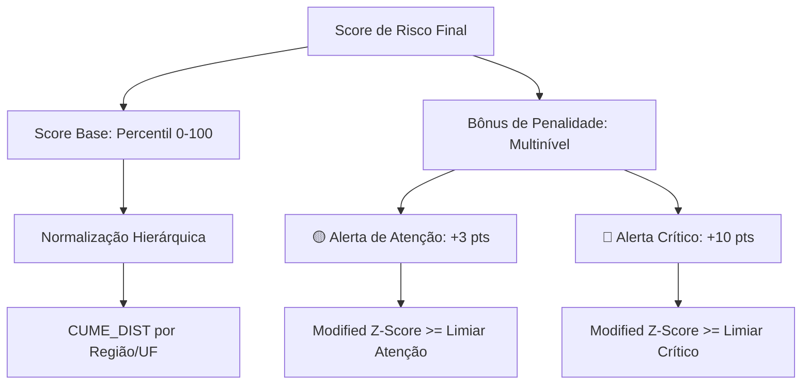

# Metodologia da Matriz de Risco (V8.2)

A Matriz de Risco Final (V8.2) utiliza uma metodologia de **Estatística Robusta** baseada no método de **Modified Z-Score (MAD)** e um sistema **Multinível de Alertas**. Ela foi projetada para ser imune a distorções causadas por fraudadores extremos e para identificar comportamentos anômalos de forma proporcional ao contexto regional.

---

## 1. Arquitetura do Score Final

O Score de Risco Final (`score_risco_final`) é a soma da posição relativa da farmácia com a gravidade das anomalias detectadas em seus indicadores.


```mermaid
graph TD
    A[Score de Risco Final] --> B[Score Base: Percentil 0-100]
    A --> C[Bônus de Penalidade: Multinível]
    
    B --> B1[Normalização Hierárquica]
    B1 --> B2[CUME_DIST por Região/UF]
    
    C --> C1[🟡 Alerta de Atenção: +3 pts]
    C --> C2[🔴 Alerta Crítico: +10 pts]
    
    C1 --> D[Modified Z-Score >= Limiar Atenção]
    C2 --> E[Modified Z-Score >= Limiar Crítico]
```

---

## 2. Detecção de Anomalias: O Método MAD

Diferente de médias aritméticas simples — que são facilmente "puxadas" por outliers — a V8.2 utiliza o **Median Absolute Deviation (MAD)**.

### 2.1. O que é o Modified Z-Score?
Para cada indicador, calculamos o quão longe a farmácia está da mediana regional usando a variabilidade real da própria região. O cálculo segue o padrão de **Iglewicz & Hoaglin**:

$$M_i = \frac{0.6745 \times (Valor - Mediana)}{MAD}$$

### 2.2. Vantagens da Metodologia
*   **Resiliência**: Um fraudador gigante na região não "esconde" os menores (a mediana e o MAD permanecem estáveis).
*   **Contexto Local**: O sistema se adapta automaticamente. Em regiões muito estáveis, pequenas anomalias disparam o alerta. Em regiões voláteis, o sistema se torna naturalmente mais tolerante.

---

## 3. Sistema Multinível (Atenção vs. Crítico)

A V8.2 introduz a calibração de dois níveis para cada um dos 18 indicadores, permitindo identificar desde o "comportamento suspeito" até a "fraude explícita".

| Nível | Flag | Penalidade | Critério Estatístico |
| :--- | :--- | :--- | :--- |
| **ATENÇÃO** | 🟡 | **+3 pontos** | $M_i \ge$ Limiar Atenção |
| **CRÍTICO** | 🔴 | **+10 pontos** | $M_i \ge$ Limiar Crítico |

### 3.1. Calibração de Sensibilidade
Cada indicador possui limiares específicos. Indicadores como **Teto Máximo** são calibrados para serem extremamente sensíveis ($M_i \ge 1.17$), enquanto **Volume Atípico** é calibrado para aceitar maior variância ($M_i \ge 3.97$).

---

## 4. Classificações de Risco (V8.2)

O enquadramento da farmácia agora considera o acúmulo de alertas de diferentes gravidades:

| Classificação | Critério Sugerido | Ação Recomendada |
| :--- | :--- | :--- |
| 🔴 **CRÍTICO** | Score Final $\ge 120$ OU $\ge 3$ Flags Vermelhos | **Auditoria Imediata** |
| 🟠 **ALTO** | Score Final $\ge 90$ | **Investigação Programada** |
| 🟡 **MÉDIO** | Score Final $\ge 60$ | **Monitoramento Ativo** |
| 🟢 **BAIXO** | Score Final $\ge 30$ | **Acompanhamento Padrão** |
| ⚪ **MÍNIMO** | Score Final $< 30$ | **Nenhuma Ação** |

---

## 5. Estrutura de Rankings e Diagnóstico

A tabela consolidada (`matriz_risco_consolidada`) fornece metadados detalhados para o auditor:

*   **`qtd_atencao`**: Número de indicadores que entraram em nível amarelo.
*   **`qtd_criticos_mad`**: Número de indicadores que entraram em nível vermelho (anomalia extrema).
*   **`pontos_penalidade`**: O valor total somado à nota base (0-100).
*   **`indicadores_risco_lista`**: Lista formatada com emojis para o Dashboard.
    *   *Exemplo:* `🔴Falecidos, 🟡Teto Máximo, 🔴Volume Atípico`

### 5.1. Exemplo de Consulta de Diagnóstico
```sql
-- Buscar estabelecimentos com alto acúmulo de alertas de atenção (Fraude Formiguinha)
SELECT TOP 20 
    razaoSocial, 
    qtd_atencao, 
    pontos_penalidade, 
    indicadores_risco_lista 
FROM temp_CGUSC.fp.matriz_risco_consolidada
WHERE qtd_atencao >= 5
ORDER BY pontos_penalidade DESC;
```

---

## 6. Evolução Metodológica

| Recurso | Modelo V7 (Antigo) | Modelo V8.2 (Produção) |
| :--- | :--- | :--- |
| **Detecção de Alerta** | Múltiplo da Média (Fixo 5x) | **Modified Z-Score (MAD)** |
| **Gradação** | Uninível (Só Crítico) | **Multinível (Atenção + Crítico)** |
| **Penalidade** | +10 por flag | **+3 (Atenção) ou +10 (Crítico)** |
| **Sensibilidade** | Igual para todos | **Calibrada por Indicador** |

---

!!! success "Princípio de Defensibilidade Jurídica"
    Com a V8.2, a auditoria pode afirmar: *"O padrão observado neste estabelecimento possui um desvio de 6.19 vezes o desvio absoluto da mediana da respectiva Região de Saúde, o que estatisticamente o situa fora de qualquer padrão de normalidade operacional"*.

---

!!! tip "Próximo Passo"
    Acesse os manuais específicos de cada indicador para conferir os cálculos de base que alimentam o motor MAD da Matriz.
